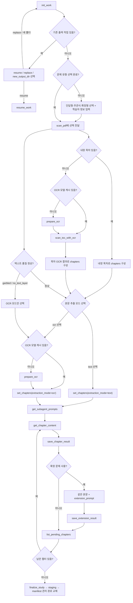

# 구조

pdf-study는 하나의 로컬 MCP 서버가 PDF 처리, 작업 상태 저장, 학습 자료 렌더링을 맡고, 챕터별 요약·문제 작성은 MCP 클라이언트의 메인 모델 또는 서브 에이전트가 수행하는 구조다. 서버는 PDF 본문을 직접 요약하지 않고, 요약자가 정확한 입력과 저장 계약을 지키도록 단계별 도구와 프롬프트를 제공한다.

## 구성

- `server.py`는 FastMCP 도구를 등록한다. 모든 도구는 같은 응답 봉투를 반환하고, 복구 가능한 예외는 `ok=false` 응답으로 바꾼다.
- `analysis.py`는 작업 흐름의 결정 지점을 묶는다. PDF 스캔 결과를 챕터 후보와 사용자 선택지로 바꾸고, 확정된 챕터를 실제 본문 입력으로 만든다.
- `workspace.py`는 `<output_dir>/.work/`의 상태·원문·요약·문제 파일을 관리한다. 같은 작업의 상태 갱신은 작업별 잠금과 원자적 JSON 저장을 거친다.
- `pdf/`는 PDF 파일을 여는 경계다. 외부로 보이는 페이지 번호는 1부터 시작하며, 내부 라이브러리의 0부터 시작하는 페이지 번호는 이 모듈 안에서만 쓴다.
- `prompts.py`는 책 정보, 학습자 맥락, 문제 유형, 처리 모드를 넣어 한국어 챕터 처리 프롬프트를 만든다.
- `renderer/`는 저장된 중립 JSON을 HTML 사이트 또는 Markdown+TUI 폴더로 변환한다. 렌더러는 PDF를 다시 읽지 않는다.
- `renderer/output_manager.py`는 렌더 staging, 학습 fingerprint, `.pdf-study-manifest.json`, 관리 경로 교체와 실패 rollback을 담당한다. 개별 렌더러는 비어 있는 staging 폴더에 한 세대만 만든다.
- `templates/`는 최종 결과물에 복사되는 런처, 정적 자산, TUI 엔진을 담는다.
- `scripts/setup_mcp.sh`는 저장소 안의 `.venv`를 만들고 검증한 뒤 Claude Code, Codex CLI, Antigravity CLI MCP 설정에 `.venv/bin/python` 절대 경로를 자동 적용한다.

## 대표 흐름

사용자가 PDF 경로와 학습 자료 생성을 요청하면 클라이언트는 `init_work`로 작업 폴더와 `work_id`를 만든다. 기존 관리 작업이 없는 폴더에서는 서버가 PDF를 읽지 않고 상태 파일과 빈 저장소를 만든다. 기존 작업이 있으면 파일을 바꾸지 않고 이어가기·교체·새 폴더 선택지를 반환하며, 교체는 사용자의 명시적 선택과 새 입력 검증 뒤에만 수행한다. 단답형·주관식·확장형 생성 여부가 미정이면 구조화된 선택지와 선택적 학습자 정보 요청을 반환한다. 클라이언트는 사용자의 답을 `scan_pdf`에 전달하며, 선택이 빠지면 서버는 스캔하지 않는다.

`scan_pdf`는 PDF 메타데이터, 텍스트 레이어 품질, 페이지 오프셋, 내장 목차를 확인한다. 내장 목차가 있으면 PDF 파일 범위 `pdf_pages`와 원문 표시 번호 `source_pages`가 담긴 챕터 후보를 반환한다. 내장 목차가 없거나 재분석이 필요하면 목차 페이지를 JPEG로 렌더하되 OCR 모델을 준비하거나 실행하지 않는다. 클라이언트는 `prepare_ocr` 후 `scan_toc_with_ocr`로 목차 OCR 텍스트를 얻고, 그 텍스트와 이미지를 확인해 챕터를 구성한다.

클라이언트가 챕터와 처리 방식을 확정하면 `set_chapters`가 스캔 여부와 입력 전체를 먼저 검증한다. 실패하면 기존 작업을 바꾸지 않으며, 성공하면 모드·챕터와 처리 시작 phase를 하나의 잠금 구간에서 상태 파일에 등록한다. 같은 작업의 다른 `set_chapters` 호출은 앞선 호출의 본문 준비와 phase 종결 뒤에 시작한다. `pdf_pages`는 본문 추출 경계로 쓰고 `source_pages`는 상태·raw·응답에 보존하는 표시 메타로만 쓴다. text 모드에서는 이 시점에 본문 텍스트를 추출해 `chapters_raw`에 저장한다. OCR 모드에서는 이 시점에 본문 페이지 이미지를 렌더링하고 PaddleOCR CPU로 읽어 `chapters_raw`에 `text`와 `char_count`를 저장한다. 본문 준비가 끝나면 `chapter_processing`은 `completed`, 하나라도 실패하면 재시도 가능한 챕터별 오류와 함께 `failed`가 된다.

`get_subagent_prompts`는 처리 모드와 학습자 정보에 맞는 한국어 프롬프트를 돌려준다. 각 챕터 처리자는 `get_chapter_content`로 입력을 받고, 요약·핵심 포인트·활성 문제 유형을 한국어로 만든 뒤 `save_chapter_result`로 저장한다. 확장 문제가 켜져 있으면 같은 챕터 본문과 학습자 정보를 받은 확장 프롬프트가 외부 검색 없이 응용 문제를 만들고 `save_extension_result`가 저장한다.

`list_pending_chapters`가 남은 요약 또는 확장 문제를 확인한다. 남은 챕터가 있으면 `finalize_study`는 기본적으로 거부한다. 모두 끝난 뒤 `finalize_study`가 HTML 또는 Markdown+TUI 결과물을 같은 중립 JSON에서 staging에 만들고, 성공한 세대의 관리 경로만 최종 폴더에 설치한다. 같은 형식과 같은 학습 fingerprint일 때만 기존 진도를 staging으로 복사한다.

## 흐름도

## 경계

서버가 맡는 경계는 PDF 처리, 챕터 원문 입력, 상태 저장, 출력 렌더링이다. 학습 자료의 실제 내용 품질은 클라이언트 모델이 맡지만, 서버는 저장 전에 필수 필드가 비어 있는 결과를 거부한다.

pdf-study 서버는 외부 검색이나 검색용 HTTP 호출을 하지 않는다. PDF 처리와 결과 렌더링은 로컬 파일 시스템에서 끝난다. 챕터 본문을 받아 실제 내용을 생성하는 모델의 네트워크 경계는 MCP 클라이언트와 모델 제공자의 실행 환경에 따르며 서버의 로컬 처리 보장과 구분한다.

최종 출력 폴더에서 서버가 소유하는 범위는 `.work`와 `.pdf-study-manifest.json`에 기록된 top-level 렌더 경로다. manifest 밖의 파일은 렌더 교체 대상이 아니며 새 결과와 이름이 충돌하면 덮어쓰지 않고 실패한다.
