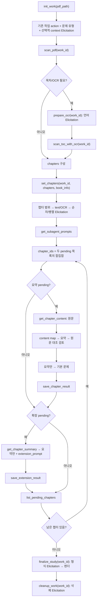

# 구조

pdf-learner는 하나의 로컬 MCP 서버가 PDF 처리, 작업 상태 저장, 학습 자료 렌더링을 맡고, 챕터별 요약·문제 작성은 MCP 클라이언트의 메인 모델 또는 서브 에이전트가 수행하는 구조다. 서버는 PDF 본문을 직접 요약하지 않고, 요약자가 정확한 입력과 저장 계약을 지키도록 단계별 도구와 프롬프트를 제공한다.

## 구성

- `server.py`는 FastMCP 도구를 등록한다. 모든 도구는 같은 응답 봉투를 반환하고,
  복구 가능한 예외는 `ok=false` 응답으로 바꾼다. 선택형 워크플로는 등록된 async
  함수 하나가 서버 프로젝트의 고정 출력 경로를 계산하고, 필수 사용자 선택을 form
  elicitation으로 받은 뒤 승인된 작업을 실행한다. 같은 작업을 선택 인자로 직접
  실행하는 별도 함수는 없다. 공개 스키마에는 선택 파라미터가 없으며 Elicitation
  미지원 세션은 fail-closed한다. 입력 없는 결과 조회 도구는 같은 고정 result
  루트의 PDF별 경로를 반환한다.
- `analysis.py`는 작업 흐름의 결정 지점을 묶는다. PDF 스캔 결과를 챕터 후보와 사용자 선택지로 바꾸고, 확정된 챕터를 실제 본문 입력으로 만든다.
- `workspace.py`는 `<output_dir>/.work/`의 상태·원문·요약·문제 파일을 관리한다. 같은 작업의 상태 갱신은 작업별 잠금과 원자적 JSON 저장을 거친다.
- `pdf/`는 PDF 파일을 여는 경계다. 외부로 보이는 페이지 번호는 1부터 시작하며, 내부 라이브러리의 0부터 시작하는 페이지 번호는 이 모듈 안에서만 쓴다.
- `prompts.py`는 책 정보, 학습자 맥락, 문제 유형, 처리 모드를 넣어 한국어 챕터 처리 프롬프트를 만든다.
- `renderer/`는 저장된 중립 JSON을 HTML 사이트 또는 Markdown+TUI 폴더로 변환한다. 렌더러는 PDF를 다시 읽지 않는다.
- `renderer/output_manager.py`는 렌더 staging, 학습 fingerprint, `.pdf-learner-manifest.json`, 관리 경로 교체와 실패 rollback을 담당한다. 개별 렌더러는 비어 있는 staging 폴더에 한 세대만 만든다.
- `templates/`는 최종 결과물에 복사되는 런처, 정적 자산, TUI 엔진을 담는다. HTML 런처는 렌더링한 프로젝트 환경의 Python으로 loopback 전용 `study_html.py`를 실행하며, `start_study.sh`와 `start_study.bat`은 포트 `0`으로 사용 가능한 포트를 자동 배정한다.
- `scripts/setup_mcp.sh`는 저장소 안의 `.venv`를 만들고 검증한 뒤 Claude Code,
  Codex CLI, Antigravity CLI의 전역 MCP 설정에 `.venv/bin/python` 절대 경로를
  자동 적용한다. Codex 전역 승인 정책이 `never`이면 다른 승인은 계속 자동
  거절하고 MCP Elicitation만 표시하는 granular 정책으로 바꾸고 원본을 백업한다.

## 대표 흐름

사용자가 PDF 경로와 학습 자료 생성을 요청하면 클라이언트는
`init_work(pdf_path)`를 호출한다. 서버는 `server.py`가 위치한 프로젝트 루트 아래
`result/<pdf-name>`을 고정 출력 폴더로 계산하며 요청 workspace와 프로세스 cwd는
사용하지 않는다. 기존 관리 작업이 있으면 같은 호출 안에서 이어가기·교체
Elicitation을 열고, 관리되지 않은 파일이 있으면 덮어쓰지 않는다. 새 작업은
단답형·주관식·확장형 생성 여부와 선택적 학습자 정보를 하나의 Elicitation으로
받은 뒤에만 만든다. 사용자는 `list_study_results()`로 같은 result 루트의 PDF별
절대 경로를 조회할 수 있다.

`scan_pdf(work_id, scan_size, force_vision)`는 PDF 메타데이터, 텍스트 레이어
품질, 페이지 오프셋, 내장 목차를 확인한다. 내장 목차가 있으면 PDF 파일 범위
`pdf_pages`와 원문 표시 번호 `source_pages`가 담긴 챕터 후보를 반환한다. 내장
목차가 없거나 재분석이 필요하면 목차 페이지를 JPEG로 렌더하되 OCR 모델을 준비하거나
실행하지 않는다. OCR이 필요하면 `prepare_ocr(work_id)`가 한국어·영어
Elicitation을 열고, 이어서 `scan_toc_with_ocr`가 목차 OCR 텍스트를 반환한다.

클라이언트가 `set_chapters(work_id, chapters, book_info)`를 호출하면 서버가 한
도구 호출 안에서 챕터 구성·범위 확인, text/OCR 본문 추출 방식,
sequential/parallel 실행 방식을 세 번의 독립된 elicitation으로 순서대로 요청한다.
어느 단계든 거절·취소되면 뒤 요청과 처리 본문을 실행하지 않는다. 모두 승인된 뒤
스캔 여부와 입력 전체를 검증하고, 성공하면 모드·챕터와 처리 시작 phase를 하나의
잠금 구간에서 상태 파일에 등록한다. 같은 작업의 다른 `set_chapters` 호출은 앞선
호출의 본문 준비와 phase 종결 뒤에 시작한다. `pdf_pages`는 본문 추출 경계로 쓰고
`source_pages`는 표시 메타로만 보존한다. text 모드는 본문 텍스트를 추출하고 OCR
모드는 PaddleOCR CPU로 읽어 `chapters_raw`의 `text`와 `char_count`를 만든다.

`get_subagent_prompts`는 처리 모드와 학습자 정보에 맞는 한국어 프롬프트와 함께 `summary_pending_chapter_ids`, `extension_pending_chapter_ids`를 돌려준다. 호환용 `chapter_ids`는 두 목록의 자연 정렬 합집합이다. 요약 pending 챕터는 `get_chapter_content`의 전체 text에서 먼저 의미 보존 `content_map`을 만들고, 그 목록으로 요약 초안을 작성한 뒤 별도 검토가 원문·목록·초안을 대조한다. 검토가 `needs_revision`이면 보완하고, 모든 section·important point가 반영돼 중요한 누락·왜곡이 없는 `passed` 요약만 다음 단계로 넘긴다. 기본 문제 생성기에는 원문과 content map을 전달하지 않고 검토를 통과한 `summary`, `key_points`와 개수 상한용 `source_char_count`만 전달한다. 두 결과와 검토 근거를 합쳐 `save_chapter_result`로 저장한다. 명시적인 서브 챕터 heading도 저장 경계에서 최종 Markdown 포함 여부를 확인한다. 이 품질 판정에는 고정 글자 수를 사용하지 않는다.

확장 pending 챕터는 완료된 요약을 `get_chapter_summary`로 받아 외부 검색 없이 응용 문제를 만들고 `save_extension_result`가 저장한다. 두 저장 도구는 공통 문제 계약으로 ID 문자·챕터 내 유일성·본문 길이별 최대 개수를 검증하고, 저장 잠금 안에서도 다른 결과 유형과의 ID 충돌을 다시 확인한다. workflow와 `next_action`도 실제로 남은 결과 유형만 안내한다.

`list_pending_chapters`가 남은 요약 또는 확장 문제를 확인한다. 챕터 설정이 완료되고
모두 끝나면 선택 파라미터 없는 `finalize_study`를 다음 단계로 반환한다.
`finalize_study(work_id)`는 출력 형식 Elicitation을 연 뒤 HTML 또는
Markdown+TUI 결과물을 staging에 만들고 성공한 세대만 설치한다. 완료 결과의 중간
데이터가 더 이상 필요 없으면 `cleanup_work(work_id)`가 삭제 Elicitation 승인 뒤
렌더 계층을 거치지 않고 해당 `.work`만 제거한다.

## 흐름도

## 경계

서버가 맡는 경계는 PDF 처리, 챕터 원문 입력, 상태 저장, 출력 렌더링이다. 학습 자료의 실제 내용 품질은 클라이언트 모델이 맡지만, 서버는 저장 전에 필수 필드가 비어 있는 결과를 거부한다.

pdf-learner 서버는 외부 검색이나 검색용 HTTP 호출을 하지 않는다. PDF 처리와 결과 렌더링은 로컬 파일 시스템에서 끝난다. 챕터 본문을 받아 실제 내용을 생성하는 모델의 네트워크 경계는 MCP 클라이언트와 모델 제공자의 실행 환경에 따르며 서버의 로컬 처리 보장과 구분한다.

최종 출력 폴더에서 서버가 소유하는 범위는 `.work`와 `.pdf-learner-manifest.json`에 기록된 top-level 렌더 경로다. manifest 밖의 파일은 렌더 교체 대상이 아니며 새 결과와 이름이 충돌하면 덮어쓰지 않고 실패한다.
