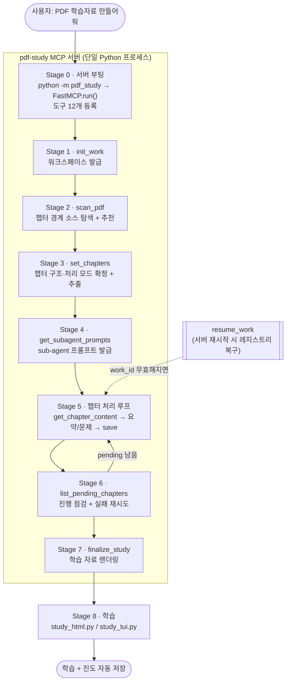
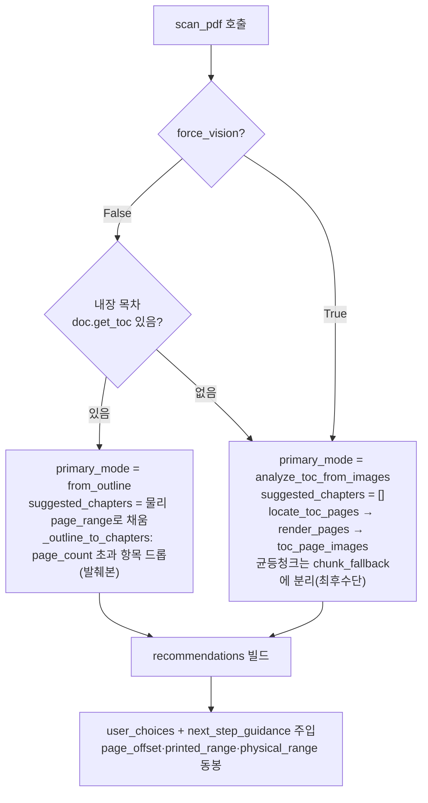
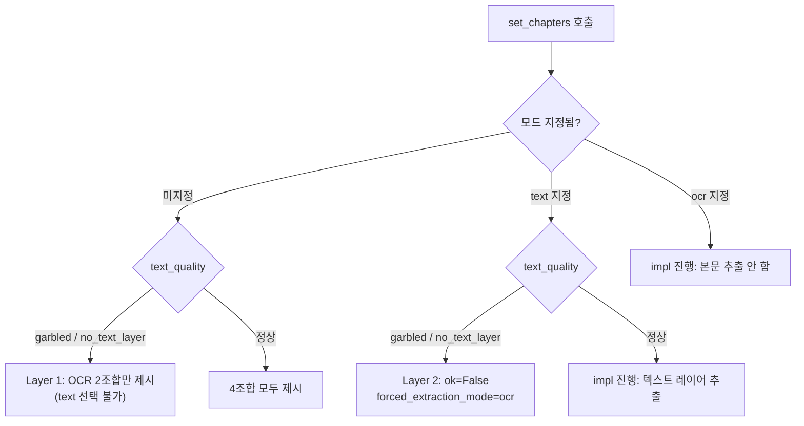
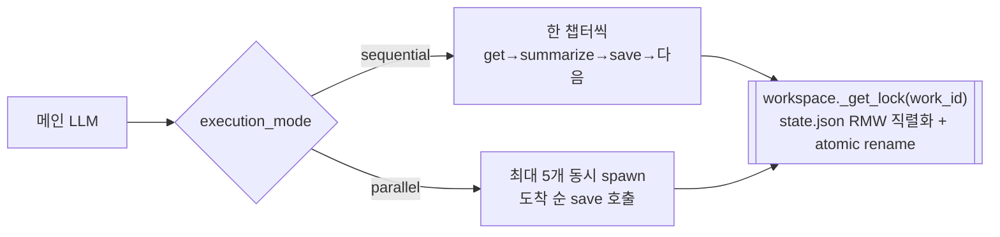
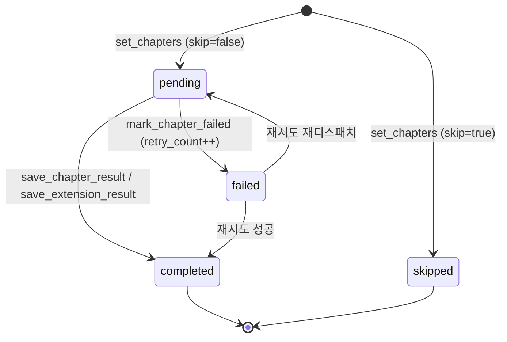
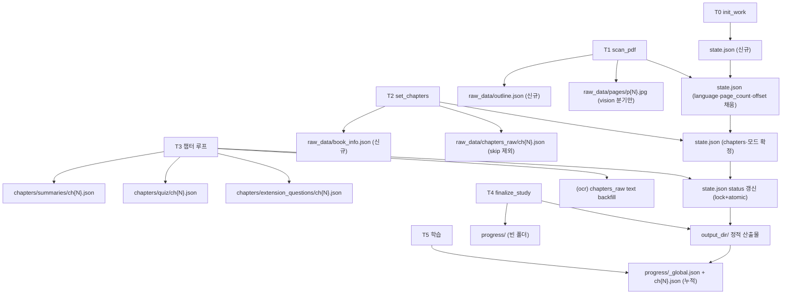

# flow. PDF 요약 전체 실행 흐름 (작업·파일·분기 총정리)

사용자가 "이 PDF로 학습 자료(요약+문제) 만들어줘"라고 했을 때, `pdf-study` MCP
서버 내부에서 **어떤 도구(작업)가 / 어떤 내부 함수를 호출하고 / 어떤 파일·데이터를
바꾸며 / 어떤 분기를 타는지**를 단계별로 모두 정리한다.

- 본문 경로는 패키지 루트(`pdf_study/`) 기준.
- 모든 MCP 도구 응답은 `{ok, error, data, next_action}` envelope로 통일된다.
- 메인 LLM(Claude/Gemini/Codex 등)이 도구를 **순서대로** 호출하고, 각 응답의
  `next_action`이 다음 단계를 안내한다.
- 상세 출처: [09-internal-flow.md](./09-internal-flow.md),
  [02-mcp-api.md](./02-mcp-api.md), [03-pdf-processing.md](./03-pdf-processing.md),
  [04-content-generation.md](./04-content-generation.md),
  [05-data-schemas.md](./05-data-schemas.md), [06-concurrency.md](./06-concurrency.md).

---

## 0. 전체 그림 (한눈에)



처리 모드(순차/병렬, text/ocr)는 `init_work`에서 받지 않는다 — **목차를 확정한 뒤
`set_chapters`에서 사용자에게 물어** 정한다.

---

## Stage 0 · 서버 부팅

| 항목 | 내용 |
|---|---|
| 진입점 | `__main__.py` → `server.main()` → `FastMCP("pdf-study").run()` |
| 하는 일 | `server.py` import 시 **12개 도구**가 mcp 인스턴스에 등록됨 |
| 안전장치 | 모든 도구는 `_safe` 데코레이터로 감싸여 예외가 `{ok:false, error:...}`로 변환 (sync/async 공통) |
| 변경 파일 | 없음 (메모리만) |

---

## Stage 1 · `init_work` — 워크스페이스 발급

메인 LLM이 사용자 발화에서 `pdf_path`, (옵션) `output_dir`, `enable_*` 4개,
`user_context`를 추출해 호출한다.

```
server.init_work(...)
  └─ workspace.create_workspace(..., work_id=make_work_id())
       ├─ _validate_options()        # PDF 존재·옵션 검증 (모드는 None으로 초기화)
       ├─ <output_dir>/.work/ 트리 생성 (raw_data/pages/ 포함)
       ├─ state.json 초기화
       └─ register(work_id → work_dir)   # in-memory registry
```

**내부 작업 / 분기**

- `output_dir`이 비면 default = `<cwd>/result/<pdf_basename>/`
  (`_pdf_name_slug`가 영숫자/한글/`_-.` 외 문자를 `_`로 치환, 같은 PDF 재실행 시 덮어씀).
- `work_id`는 `YYYYMMDD-HHMMSS` 타임스탬프. state.json에만 기록.
- 처리 모드는 받지 않으므로 `execution_mode=None`, `extraction_mode=None`으로 시작.

**변경 파일/데이터**

| 파일 | 변경 |
|---|---|
| `.work/state.json` | **신규 생성** — work_id, pdf_path, output_dir, started_at, enable_* (`question_options`), user_context, `execution_mode=null`, `extraction_mode=null`, 모든 `phases=pending` |
| `.work/` 디렉토리 트리 | `raw_data/`, `raw_data/pages/`, `chapters/{summaries,quiz,extension_questions}/` 빈 폴더 |

- 응답 `data`: `{work_id, work_dir, output_dir(실제 절대경로)}`
- `next_action`: `scan_pdf(work_id, scan_size=30)`

---

## Stage 1b · `resume_work` — 워크스페이스 재부착 (선택 분기)

`register`는 **메모리 레지스트리**(`workspace._registry`)에만 있으므로, MCP 서버
프로세스가 재시작되면 매핑이 사라져 `get_work_state(work_id)` 등이
`unknown work_id`로 실패한다. 이때 사용.

```
server.resume_work(output_dir="", pdf_path="")
  └─ workspace.resume_workspace(output_dir)
       ├─ <output_dir>/.work/state.json 읽기
       ├─ state["work_id"]로 register() 재호출 → 레지스트리 복구
       └─ list_pending_chapters_impl로 남은 챕터 계산
```

**분기**: `output_dir`이 있으면 그 폴더, 없으면 `pdf_path`로 default 경로 추론.

- **변경 파일 없음** (디스크의 `completed` 챕터는 그대로 보존).
- 응답 `data`: `{work_id, output_dir, current_phase, execution_mode, extraction_mode,
  summary_pending, extension_pending}` (모드는 set_chapters 전이면 null)
- 복구 후 메인 LLM은 **pending 챕터만 이어서** 처리하고 finalize (Stage 5~7 재진입).

---

## Stage 2 · `scan_pdf` — 챕터 경계 소스 + 추천

```
server.scan_pdf(work_id, scan_size=30, force_vision=False)
  └─ analysis.scan_pdf_impl(...)
       ├─ workspace.update_phase("scanning", "in_progress")
       ├─ reader.open_pdf(pdf_path)
       │    ├─ reader.extract_metadata(doc)        # book metadata (페이지 안 읽음)
       │    ├─ reader.evaluate_text_quality(doc, scan_size)  # 30p 한 번 읽기 → text_quality + sample_text
       │    ├─ if text_quality == "no_text_layer": # ★ 단락: 스캔본이면 아래 둘 생략
       │    │      language=None, offset=None/none  #   (불필요한 페이지 읽기 회피)
       │    │  else:
       │    │      lang.detect_language(quality["sample_text"])  # 품질 샘플 재사용(재독 X)
       │    │      reader.detect_page_offset(doc)               # 꼬리말 번호 다수결 → offset
       │    ├─ reader.get_outline(doc)             # ① 내장 목차(북마크) — 1순위 (페이지 안 읽음)
       │    │    └─ _outline_to_chapters(...)      # 최상위 항목 → 물리 page_range
       │    └─ (내장 목차 없음/force_vision)
       │         reader.locate_toc_pages → render_pages → toc_page_images  # ②
       ├─ _build_recommendations(...)
       ├─ workspace.update_state(page_count, text_quality, language, page_offset, confidence)
       ├─ workspace.update_phase("scanning", "completed")
       └─ workspace.save_outline(...)              # .work/raw_data/outline.json
```

### 핵심 원칙

**목차/챕터 경계는 텍스트 레이어를 신뢰하지 않는다** (스캔본·모지바케에서 제목↔페이지
정렬이 깨짐). 그래서 **내장 목차** 또는 **목차 페이지 이미지(vision)** 둘 중 하나로만
정한다. `scanned_text`는 **응답에 노출하지 않는다**. 목차 결정은 텍스트 품질로 거부하지
않는다(품질은 본문 추출 모드 가드에만 쓰임 — Stage 3).

### scan이 읽는 페이지 (목차와 무관)

내장 목차(`get_outline`=`doc.get_toc`)는 **페이지를 안 읽는다**(북마크 메타). scan의
페이지 읽기는 아래 3가지용이며, **`no_text_layer`면 offset·language를 단락**한다:

| 읽기 | 양 | 용도 | no_text_layer 시 |
|---|---|---|---|
| `evaluate_text_quality` | `min(scan_size=30, page_count)` 1회 | text_quality(mojibake) + sample_text | 항상 실행 |
| `lang.detect_language` | (품질 sample_text 재사용, 추가 읽기 0) | 언어 | **건너뜀(None)** |
| `detect_page_offset` | `min(page_count, ~400)` 꼬리말 | page_offset | **건너뜀(none)** |
| `locate_toc_pages` | 내장목차 없을 때만 `min(30, page_count)` | 목차 페이지 위치 | (vision 경로일 때만) |

> 품질 평가와 언어 감지는 **같은 한 번의 30p 읽기**(`evaluate_text_quality`가 읽은
> `sample_text`)를 공유한다 — 별도 추출 패스 없음. (`extract_text_range`는 챕터 본문
> 추출 전용으로 `pdf/chapter.py`에서 계속 사용.)

> "최대 N"은 불확정이 아니라 `min(page_count, N)`이다 — 작은 책은 전부, 큰 책은 N에서 상한.

### 분기 ①②③ (primary_mode 결정)



| primary_mode | 트리거 | 메인 LLM이 할 일 | user_choices |
|---|---|---|---|
| `from_outline` | 내장 목차 있음 | suggested_chapters를 사용자에게 보여 확인 | 4택: ①이대로 ②틀림→vision재분석(force_vision) ③직접입력 ④청크 |
| `analyze_toc_from_images` | 내장 목차 없음 / `force_vision=True` | toc_page_images를 **vision으로 직독**해 from_toc 직접 구성 (텍스트 추정 금지) | 3택: ①이대로 ②직접입력(PDF 물리) ③청크 |

### page_offset 분기 (confidence)

`reader.detect_page_offset`이 꼬리말 인쇄번호 다수결로 측정 (물리 = 책 + offset, 음수 가능).

| confidence | 조건 |
|---|---|
| `high` | 최빈 지지 ≥3 & 2등의 2배+ |
| `low` | 측정됐으나 약함 |
| `none` | 인쇄번호 신호 없음 (이미지/무텍스트 PDF) → `offset=None` |

**변경 파일/데이터**

| 파일 | 변경 |
|---|---|
| `.work/state.json` | `page_count`, `text_quality`, `language`, `page_offset`, `page_offset_confidence` 채움 / `phases.scanning = completed` |
| `.work/raw_data/outline.json` | **신규 생성** (목차 소스 + offset) |
| `.work/raw_data/pages/p{N}.jpg` | (vision 분기일 때만) 목차 페이지 JPEG 렌더 |

- 응답 `data`: `book_metadata, language, page_offset, outline_present, toc_page_images,
  recommendations.{primary_mode, suggested_chapters, chunk_fallback, alternatives,
  user_choices, next_step_guidance}`

---

## Stage 3 · `set_chapters` — 챕터 구조 + 처리 모드 확정 + 추출

메인 LLM이 챕터 목록과 **두 모드를 사용자에게 물어** 전달한다.

```
server.set_chapters(work_id, chapters, execution_mode, extraction_mode, book_info, language)
  └─ analysis.set_chapters_impl(...)
       ├─ execution_mode/extraction_mode 검증     # 미지정/오타 → ok=False (4조합 choices)
       ├─ workspace.update_state(execution_mode, extraction_mode)   # 여기서 확정
       ├─ _validate_chapter_def(ch, page_count)   # 페이지 범위 검증
       ├─ (ocr & language 주어지면) update_state(language)
       ├─ workspace.set_chapters_in_state(work_id, normalized)
       │    - skip=True → status=skipped / 그 외 → status=pending
       │    - phases.chapter_setup = completed
       ├─ workspace.save_book_info(...)           # 없으면 PDF 메타 fallback
       ├─ workspace.update_phase("chapter_processing", "in_progress")
       └─ for ch in normalized:
            ├─ skip이면 추출 자체 건너뜀 (raw 파일 없음)
            ├─ (text) chapter.extract_chapter(doc, ch)   # 본문 text + char_count
            ├─ (ocr)  본문 추출 안 함 (char_count=0)
            ├─ workspace.save_chapter_raw(...)           # chapters_raw/ch{N}.json
            └─ workspace.update_chapter_status(char_count=...)
```

### 분기 A — 모드 검증 (가드)

`execution_mode`("sequential"|"parallel")·`extraction_mode`("text"|"ocr") **기본값 없음.**
하나라도 미지정/오타 → `ok=False` + `data.choices`에 조합 반환(빼지 말 것).

- **정상 텍스트 레이어**(text_quality=low/medium/high): **4조합 모두** 제시.
- **garbled(mojibake)/no_text_layer**: text 추출이 무의미 → `data.choices`를 **OCR
  2조합으로만** 좁혀 반환(`extraction_modes=["ocr"]`, `forced_extraction_mode="ocr"`).
  즉 사용자가 **text를 애초에 못 고르게** 한다(사전 차단). scan이 텍스트 레이어로
  측정해 둔 값을 재사용(재독 없음).

### 분기 B — extraction_mode (본문 추출 방식)

| 모드 | 본문 추출 | 적합 | 비용 |
|---|---|---|---|
| `text` | PyMuPDF 텍스트 레이어 (`extract_chapter`) → 이 시점에 `text`·`char_count` 채움 | 디지털/전자책 | 빠름·저렴 |
| `ocr` | **추출 안 함** (`char_count=0`). 본문은 Stage 5에서 sub-agent가 page_images를 읽어 backfill | 스캔본·글꼴 깨짐 | 느림·비쌈 |

> OCR 모드는 `language` 필수 (텍스트 언어감지 불가하니 LLM이 이미지로 파악해 전달).
> text 모드는 scan_pdf가 자동 감지하므로 생략 가능.

#### text 모드 가드 (mojibake → OCR 강제) — 2단 방어

scan_pdf가 측정한 `state.text_quality`가 `garbled`(인코딩 깨짐) 또는 `no_text_layer`
(텍스트 거의 없음)이면 라이브러리 추출 본문이 쓰레기가 되므로, text 모드를 **두
지점에서** OCR로 강제한다. (scan이 텍스트 레이어로 계산해 둔 값을 재사용 — 재독 없음.
`mojibake_score`를 실제 결정에 연결하는 소비처.)

- **Layer 1 — 사전 차단(선택지 좁히기, 분기 A):** 모드 미지정 거부 시 `data.choices`를
  **OCR 2조합으로만** 제시 → 사용자가 text를 애초에 못 고름.
- **Layer 2 — 사후 거부(강제):** 그래도 `extraction_mode="text"`로 호출하면 **impl
  진입 전에 `ok=False`**로 거부하고 `forced_extraction_mode="ocr"`로 재호출 유도
  (`execution_mode`는 고른 값 유지).

`low`/`medium`/`high`는 통과(오탐 방지).



### 분기 C — skip 챕터

`skip:true`(찾아보기·색인·판권 등 비본문)는 **raw 추출·sub-agent 디스패치·HTML
렌더링에서 모두 제외**, status는 `skipped`.

**변경 파일/데이터**

| 파일 | 변경 |
|---|---|
| `.work/state.json` | `execution_mode`·`extraction_mode` 확정 / `chapters` 채움(각 title·page_range·char_count·skip·summary_status·extension_status·error·retry_count — printed_range는 state엔 저장 안 함, scan 추천에만 존재) / `phases.chapter_setup=completed`, `phases.chapter_processing=in_progress` |
| `.work/raw_data/book_info.json` | **신규 생성** (없으면 PDF 메타 fallback) |
| `.work/raw_data/chapters_raw/ch{N}.json` | **신규 생성** (skip 제외). text 모드=본문 채움 / ocr 모드=text 없음·char_count=0 |

- `next_action`: `get_subagent_prompts(work_id)`

---

## Stage 4 · `get_subagent_prompts` — sub-agent 프롬프트 발급

```
server.get_subagent_prompts(work_id)
  ├─ state = workspace.load_state(work_id)
  ├─ book_info = workspace.load_book_info(work_id)
  └─ prompts.build_prompts(state, book_info)
       ├─ language로 KO/EN 템플릿 선택 (SUMMARIZER_*, EXTENSION_*)
       ├─ user_context·book_info·enabled_types·scales_table 치환
       ├─ execution_mode로 sequential / parallel workflow_instructions 분기
       └─ chapter_ids(skip 제외) + skipped_chapter_ids 분리 반환
```

**분기**: `language`(ko/en), `execution_mode`(workflow_instructions),
`extraction_mode`(ocr이면 page_images OCR 지시 `INPUT_MODE_OCR_*`),
`enable_extension`(off면 extension_prompt 미사용).

- **변경 파일 없음** (읽기 전용).
- 응답 `data`: `mode, language, extraction_mode, summarizer_prompt, extension_prompt,
  workflow_instructions, chapter_ids, skipped_chapter_ids, enabled_types`
- 메인 LLM은 이 시스템 프롬프트를 자기 환경(Task tool/직접 처리)에 주입.

---

## Stage 5 · 챕터 처리 루프 (sub-agent 디스패치)

`workflow_instructions`(sequential/parallel)에 따라 메인 LLM이 디스패치한다.
챕터당 흐름:

```
(1) get_chapter_content(work_id, chapter_id)
       └─ analysis.get_chapter_content_impl
            - text 모드: get_chapter_raw → text 반환
            - ocr  모드: page_range를 lazy 렌더(render_pages) → page_images(절대경로) 반환
                         (디스크 raw엔 page_images를 저장하지 않음)

(2) summarizer sub-agent (메인 LLM이 프롬프트로 호출)
       - text: text를 읽어 요약/문제 생성
       - ocr : page_images를 순서대로 읽어 본문 OCR (읽어낸 글자수로 스케일 적용)
       - 결과 JSON: {summary(마크다운), key_points, questions:{mc,sa,rf}, body_text?(ocr)}

(3) save_chapter_result(work_id, chapter_id, data)
       └─ workspace.save_chapter_result   # ↓ lock 보호 + atomic write
            - chapters/summaries/ch{N}.json + chapters/quiz/ch{N}.json 2파일 분리 저장
            - (ocr & body_text) chapters_raw/ch{N}.json의 text로 backfill + char_count 갱신
            - state lock 안에서 summary_status = completed

(4) (extension 활성 시) search_extension_context(work_id, chapter_id, query)
       └─ exa_client.search(query)   # Exa Web Research MCP HTTP
       - 실패해도 빈 results + ok=True (graceful degrade)

(5) extension sub-agent → save_extension_result(work_id, chapter_id, data)
       └─ chapters/extension_questions/ch{N}.json + extension_status = completed
```

### 분기 D — execution_mode (디스패치 방식)



| 모드 | 디스패치 | state 안전성 |
|---|---|---|
| `sequential`(기본) | 한 챕터씩 | 자연 순차라 보장 |
| `parallel` | 최대 5개 동시 (Claude Code Task tool만 진짜 병렬; Gemini/Codex는 메인이 순차) | MCP 서버의 **work_id별 threading.Lock + atomic write**가 보장 |

### 분기 E — extraction_mode (입력 형태)

- **text**: `get_chapter_content`가 `text` 제공 → sub-agent가 읽고 생성.
- **ocr**: 본문 없음 → `page_images`(JPEG 절대경로)를 멀티모달로 읽어 **본문 직접 OCR**,
  읽어낸 `body_text`가 `chapters_raw`의 `text`로 backfill되어 최종 raw는 text 모드와 동형.

### 분기 F — extension 옵션 / Exa 실패

- `enable_extension=False`면 (4)(5) 생략, `extension_status`는 처음부터 처리 대상 아님.
- Exa 검색 실패해도 `ok=True` + 빈 results로 graceful degrade (확장 문제는 context 없이 생성).

### 문제 개수·요약 길이 스케일 (sub-agent가 글자수로 적용)

| 글자 수 | 객 | 단 | 주 | 확 | 요약 길이 |
|---|---|---|---|---|---|
| <3,000 | 3 | 1 | 1 | 1 | ~본문 1/2 |
| 3K–10K | 5 | 2 | 2 | 1 | ~1/3 |
| 10K–25K | 7 | 3 | 2 | 2 | ~1/3 |
| 25K+ | 10 | 4 | 3 | 3 | ~1/4 |

**변경 파일/데이터**

| 파일 | 변경 |
|---|---|
| `.work/raw_data/pages/p{N}.jpg` | (ocr) 챕터 페이지 lazy 렌더 (캐시·재사용) |
| `.work/chapters/summaries/ch{N}.json` | **신규** (summary 마크다운 + key_points) |
| `.work/chapters/quiz/ch{N}.json` | **신규** (mc/sa/rf 문제) |
| `.work/raw_data/chapters_raw/ch{N}.json` | (ocr) `text` backfill + `char_count` 갱신 |
| `.work/chapters/extension_questions/ch{N}.json` | (extension) **신규** (확장 문제 + 출처) |
| `.work/state.json` | `summary_status`/`extension_status` → `completed` (lock 보호) |

---

## Stage 6 · `list_pending_chapters` — 진행 점검 + 재시도

```
server.list_pending_chapters(work_id)
  └─ workspace.list_pending_chapters_impl
       - summary_pending   : status not in (completed, skipped)
       - extension_pending : 위와 동일 (option off면 빈 list)
```

- `completed`·`skipped`는 모두 "처리 완료"로 취급, `pending`/`in_progress`/`failed`만 미처리.
- 실패 챕터는 `workspace.mark_chapter_failed`로 `status=failed` + `retry_count++` →
  메인 LLM이 **1회 재시도 후 포기**하기 좋게 신호.
- **분기**: pending 남으면 → Stage 5로 되돌아가 재처리.

### 챕터 상태 전이 (서브에이전트 상태)

> **주의 — 두 축을 혼동하지 말 것.** state.json엔 서로 다른 두 축이 있다:
> ① **서브에이전트 상태** = `chapters[*].summary_status`/`extension_status`
>    (값: pending/in_progress/completed/failed/skipped — 아래 다이어그램)
> ② **파이프라인 단계** = `current_phase` + `phases.{scanning, chapter_setup,
>    chapter_processing, rendering}` (값: pending/in_progress/completed).
> `chapter_processing`은 ②의 **단계 이름**이지 ①의 상태값이 아니다 — `set_chapters`가
> `update_phase("chapter_processing", "in_progress")`로 단계를 바꾸는 것.



- 변경 파일: `state.json`(실패 시 `status`/`retry_count`). 그 외엔 읽기 전용.

---

## Stage 7 · `finalize_study` — 학습 자료 렌더링

```
server.finalize_study(work_id, output_format="", keep_work_dir=True, force=False)
  ├─ output_format 미지정 → ok=False (html/md_tui 사용자에게 물어볼 것)
  ├─ 완료 가드: list_pending_chapters_impl로 pending 확인
  │     pending 남고 force=False → ok=False + data에 pending 목록 (조용한 부분 렌더 방지)
  ├─ RENDERERS[output_format]()    # html→HtmlRenderer, md_tui→MdTuiRenderer
  └─ renderer.render(work_id, output_dir)
       ├─ _load_all (state, book_info, summaries+quiz 병합, extension, chapters_raw)
       │    + _unescape_if_double_escaped (리터럴 \n 이중 이스케이프 자가복구)
       │    + skip=True 챕터 제외
       ├─ _copy_assets
       └─ 요약 마크다운 → HTML (markdown-it, 없으면 _FallbackMd)
  └─ (keep_work_dir=False) shutil.rmtree(.work)
```

### 분기 G — output_format

`output_format` **기본값 없음** — 미지정 시 `ok=False`로 거부(html/md_tui 물어볼 것).
같은 work_id로 format만 바꿔 두 번 호출하면 두 포맷 모두 생성 가능.

| format | 렌더러 | 산출물 |
|---|---|---|
| `html` | HtmlRenderer | index.html(또는 main.html), ch{N}.html, assets/{style.css,storage.js,grading.js}, study_html.py, progress/, README.md |
| `md_tui` | MdTuiRenderer | book.md, study_tui.py, 챕터별 ch{N}/{summary.md, quiz.json, study_tui.py shim, progress.json}, README.md |

### 분기 H — 완료 가드 / force

- pending 남고 `force=False` → 거부 (`data.{summary_pending, extension_pending}` 반환).
- 끝내 실패한 챕터가 있어도 부분 결과를 만들려면 `force=True`.

### 분기 I — 단일 vs 멀티 챕터 (html)

- 멀티: `index.html`(책 정보+챕터 카드) + `ch{N}.html`(사이드바·완료 버튼).
- 단일: `main.html`(책 정보 상단, 사이드바 없음). `index.html` 생략.

### 분기 J — keep_work_dir

- `True`(기본): `.work/` 보존 (재실행 캐시).
- `False`: 렌더 후 `.work/` 삭제. 메인 LLM은 사용자에게 보존/삭제 여부를 묻고
  삭제 원하면 `keep_work_dir=False`로 **재호출**.

**변경 파일/데이터**

| 위치 | 변경 |
|---|---|
| `<output_dir>/` | 학습 자료 정적 산출물 신규 생성 (위 표) |
| `<output_dir>/progress/` | 빈 폴더 생성 (학습 시 채워짐) |
| `.work/` | (keep_work_dir=False) 삭제 |

- `next_action`: 실행 명령 (`data.launch_command`는 **서버 인터프리터 `sys.executable`**
  기준이라 의존성 깔린 venv로 바로 실행) + `.work` 보존/삭제 질문.

---

## Stage 8 · 학습 (런처 실행)

| format | 런처 | 동작 |
|---|---|---|
| html | `study_html.py` | 정적 서빙 + 진도 API. `GET/POST /api/progress/{global,ch{N}}` (파일명 `^[a-zA-Z0-9_-]+$` 검증, 잘못된 JSON 400). storage.js가 답안/완료/last_position 저장 |
| md_tui | `study_tui.py` | rich 기반 TUI (없으면 자동설치→평문 폴백). progress.json 직접 저장 |

**변경 파일/데이터** (학습 중 누적)

| 파일 | 내용 |
|---|---|
| `progress/_global.json` | last_chapter, last_position, last_updated |
| `progress/ch{N}.json` | answers(mc/sa/rf/ex), mc_score(맞은수/전체), completed(사용자 버튼), last_position |

---

## 부록 · 디스크 변경 타임라인



---

## 부록 · 호출 순서 요약 (메인 LLM 관점)

```
init_work (처리 모드 안 받음)
  → scan_pdf
      ├ from_outline: suggested_chapters 사용자 확인. 틀리면 scan_pdf(force_vision=True)
      └ analyze_toc_from_images: toc_page_images를 vision으로 직독해 목차 구성
  → set_chapters (execution_mode·extraction_mode 사용자에게 물어 전달, skip 표시, ocr이면 language)
  → get_subagent_prompts
  → for each chapter_id (sequential | parallel):
        get_chapter_content (text: text / ocr: page_images)
        → summarizer sub-agent → save_chapter_result
        → (extension) search_extension_context → extension sub-agent → save_extension_result
  → list_pending_chapters → 실패 1회 재시도
  → finalize_study (output_format 물어 전달; pending 남으면 거부, force=True로 우회)
  → 실행 명령 안내 + .work 보존/삭제 질문

* 서버 재시작으로 work_id 무효 → resume_work(output_dir|pdf_path)로 복구 후 이어서
```
