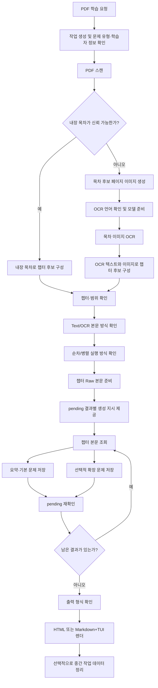

# pdf-learner 제품 및 동작 명세

## 0. 문서의 목적과 사용 방법

이 문서는 `pdf-learner`를 설계·구현하는 데 필요한 제품 요구사항과 동작 계약을
정의한다. 사용자가 얻어야 하는 결과, 시스템 경계, 데이터 의미, 처리 흐름, 실패와
복구 규칙을 자체 완결적으로 설명한다.

이 문서는 다음 원칙을 따른다.

- 이 문서는 제품 요구사항의 기준 문서다.
- 초기 MCP 클라이언트 지원 대상은 Codex CLI 하나뿐이다.
- 이 문서에 정의되지 않은 제품 동작은 임의로 추측하지 않고 사용자에게 질문한다.
- 아래 도구 이름은 흐름을 설명하기 위한 역할명이다. 구현에서 이름을 바꿀 수 있지만
  동등한 기능과 안전 경계는 제공해야 한다.
- 내부 모듈 구성, 함수 분리, 라이브러리 호출 순서는 이 문서의 제약이 아니다.

문서 상태는 **제품 설계 기준 확정본**이다. `직접 페이지 범위 입력`과 `균등 청크`
기능은 초기 범위에서 제외되어 후속 결정으로 남아 있다.

---

## 1. 제품 정의

### 1.1 한 문장 정의

`pdf-learner`는 Codex CLI에서 사용자의 로컬 PDF를 읽어 챕터별 요약, 핵심 포인트,
학습 검증 문제, 선택적 확장 문제와 진도 저장 기능을 갖춘 HTML 또는 터미널 학습
자료로 변환하는 로컬 MCP 서비스다.

### 1.2 해결하려는 문제

일반 PDF 요약은 내용을 짧게 줄이는 데 그치며, 사용자가 챕터를 순서대로 공부하고
이해도를 점검하며 중단한 위치에서 다시 시작하는 경험을 제공하지 않는다.
`pdf-learner`는 PDF를 다음과 같은 학습 단위로 바꾼다.

- 책의 실제 논리 구조를 반영한 챕터
- 챕터별 한국어 요약
- 기억해야 할 핵심 포인트
- 본문 근거로 정답을 검증할 수 있는 기본 문제
- 본문 개념을 현실·실무 맥락으로 확장하는 선택적 문제
- 답안, 객관식 결과, 완료 여부를 저장하는 학습 진도
- 비개발자도 실행할 수 있는 HTML 학습 화면
- 터미널 사용자가 선택할 수 있는 Markdown+TUI 학습 화면

### 1.3 대상 사용자

대상은 개발자로 한정하지 않는다.

- PDF로 된 책이나 강의 자료를 공부하는 사람
- 종이책을 PDF로 만든 뒤 챕터별 학습 자료가 필요한 사람
- 브라우저에서 문제를 풀고 진도를 저장하려는 비개발 사용자
- Markdown과 터미널 환경을 선호하는 사용자
- 학습 목적, 배경지식, 관심 분야, 현재 수준에 맞는 문제를 원하는 사용자

### 1.4 사용자가 기대하는 최종 결과

사용자는 PDF 경로를 한 번 제공하고 필요한 선택에 답한 뒤 다음 결과를 받아야 한다.

- 챕터가 올바른 PDF 페이지 범위에 연결되어 있다.
- 각 본문 챕터에 요약과 핵심 포인트가 있다.
- 활성화한 문제 유형이 챕터별로 제공된다.
- 객관식은 즉시 채점할 수 있다.
- 서술형 문제에는 학습자가 비교할 수 있는 모범 답안이 있다.
- HTML과 TUI 모두 같은 학습 내용을 보여준다.
- 학습을 중단했다가 다시 실행하면 저장된 답안과 완료 상태를 이어갈 수 있다.
- 일부 챕터 생성에 실패하더라도 완성된 부분은 결과물로 볼 수 있고, 무엇이
  빠졌는지 명확히 알 수 있다.

### 1.5 제품 성공 기준

다음 조건을 모두 충족하면 제품의 핵심 목적을 달성한 것으로 본다.

1. PDF가 로컬 파일 시스템 안에서 열리고 처리된다.
2. 챕터 경계가 PDF 북마크 또는 목차 페이지 이미지에서만 결정된다.
3. 신뢰할 수 없는 텍스트 레이어가 OCR 없이 본문으로 사용되지 않는다.
4. 사용자의 선택을 에이전트가 대신 결정할 수 없다.
5. 각 챕터의 생성 결과는 저장 전에 완전성과 본문 근거 규칙을 검증한다.
6. 같은 저장 결과에서 HTML과 Markdown+TUI를 만들 수 있다.
7. 실패한 결과를 완료로 표시하거나 이전 결과를 새 결과처럼 섞지 않는다.
8. 출력 교체가 사용자 파일과 설치된 정상 렌더 세대를 손상하지 않는다.
9. 서버가 PDF 본문이나 생성 결과를 외부 검색 서비스로 보내지 않는다.

---

## 2. 확정 설계 결정

| 항목 | 결정 |
| --- | --- |
| 초기 MCP 클라이언트 | Codex CLI만 지원한다. Claude Code와 Antigravity는 초기 범위에서 제외한다. |
| 사용자 선택 채널 | Codex CLI가 제공하는 MCP form elicitation만 사용한다. |
| 챕터 ID | `CH1`, `CH2`, `CH10`처럼 `CH`와 1 이상의 정수로 구성한다. 대문자를 사용한다. |
| 챕터 범위 관계 | 챕터 사이의 겹침과 빈 구간을 허용한다. 연속성이나 상호 배타성을 강제하지 않는다. |
| 범위 기술 검증 | 시작은 1 이상, 끝은 시작 이상, 끝은 PDF 전체 페이지 이하인지 검사한다. |
| 직접 입력 | 사용자가 페이지 범위를 직접 입력하는 기능은 초기 범위에서 제외한다. |
| 균등 청크 | 일정 페이지 수로 자동 분할하는 기능은 초기 범위에서 제외한다. |
| 미완료 챕터 렌더 | 미완료 챕터도 최종 목차와 챕터 페이지 틀에 포함한다. 완료된 결과만 내용을 채운다. |
| 책 정보 | 표준 필드는 모두 선택 사항이며, 없는 정보는 추측하지 않고 `null`로 저장한다. |
| 제목 fallback | 저장된 `title`이 없을 때만 화면 표시용으로 PDF 파일명을 사용한다. |
| 오류 상태 | 요약 오류와 확장 문제 오류를 별도로 관리한다. |
| 재시도 횟수 | 영속 상태에 재시도 횟수를 저장하지 않는다. |

챕터 ID의 유효 형식은 다음 정규식 의미와 같다.

```text
^CH[1-9][0-9]*$
```

한 작업 안에서 챕터 ID는 중복될 수 없다. 숫자 부분을 기준으로 자연 정렬해야 하므로
`CH2`가 `CH10`보다 앞에 온다.

---

## 3. 핵심 용어

### 3.1 작업

하나의 PDF를 하나의 학습 자료로 만드는 전체 생명주기다. 작업은 PDF 위치, 출력 위치,
사용자 선택, 스캔 결과, 챕터 정의, 원문, 생성 결과와 처리 상태를 가진다.

### 3.2 PDF 페이지

PDF 파일 안에서의 실제 페이지 위치다. 모든 공개 경계에서 1부터 시작하며 양 끝을
포함한다. 챕터 본문 추출 범위의 유일한 기준이다. 필드명은 `pdf_pages`다.

```json
{
  "pdf_pages": [12, 28]
}
```

### 3.3 원문 페이지

책 종이에 인쇄되거나 화면에 표시된 페이지 번호다. PDF 앞에 표지, 판권, 목차가
추가되면 PDF 페이지와 다를 수 있다. 표시용 메타데이터이며 본문 추출에는 사용하지
않는다. 필드명은 `source_pages`다.

### 3.4 챕터

학습 자료를 만드는 논리적 단위다. 각 챕터는 ID, 제목, PDF 페이지 범위, 선택적 원문
페이지 범위, 학습 대상 제외 여부를 가진다.

### 3.5 비본문 챕터

표지, 판권, 색인, 찾아보기, 저자 소개처럼 학습 본문이 아닌 구간이다. `skip=true`로
표시하며 원문 추출, 요약 생성, 문제 생성, 최종 학습 페이지에서 모두 제외한다.
실제 본문을 처리 실패 때문에 `skip`으로 숨겨서는 안 된다.

### 3.6 Raw 본문

Text 또는 OCR 방식으로 PDF에서 얻어 서버가 보존하는 챕터 원문 텍스트다. 요약이나
문제 생성 결과가 이 값을 덮어쓸 수 없다.

### 3.7 기본 결과

한 챕터의 요약, 핵심 포인트, 객관식, 단답형, 주관식 문제를 묶은 결과다.

### 3.8 확장 결과

한 챕터의 개념을 현실·실무·판단 상황으로 넓히는 선택적 확장 문제 결과다. 기본
결과와 별도로 생성하고 저장한다.

### 3.9 렌더 세대

저장된 중립 학습 데이터를 HTML 또는 Markdown+TUI 파일로 완전히 변환한 한 번의
출력 묶음이다. 새 세대가 완성되기 전에는 이전 세대를 건드리지 않는다.

### 3.10 학습 fingerprint

이전 진도를 새 렌더 결과에 적용해도 되는지를 판단하는 결정적 식별값이다. 출력
형식과 fingerprint가 모두 같을 때만 진도를 재사용한다.

---

## 4. 시스템 경계와 책임

### 4.1 로컬 MCP 서비스의 책임

- 작업 생성과 재개
- 출력 폴더 결정과 충돌 보호
- PDF 열기와 메타데이터 확인
- 텍스트 레이어 품질 평가
- PDF 북마크 읽기
- 목차 후보 페이지 이미지 생성
- OCR 모델 준비와 목차·본문 OCR
- 챕터 정의 검증
- Raw 본문 저장
- 생성 프롬프트와 처리 순서 제공
- 요약·문제 결과 검증과 저장
- 상태와 pending 목록 관리
- HTML 또는 Markdown+TUI 렌더링
- 렌더 세대 교체와 진도 재사용 가능성 판단
- 완료 후 중간 작업 데이터 정리

### 4.2 Codex CLI 또는 생성 모델의 책임

- 사용자의 학습 자료 생성 의도를 인식하고 전체 MCP 흐름을 시작
- 목차 OCR 텍스트와 목차 이미지를 함께 확인해 챕터 후보 구성
- 책 정보를 확인 가능한 범위에서 정리
- 서버가 제공한 챕터 본문과 프롬프트로 요약·문제 생성
- 순차 또는 병렬 처리 지시 준수
- 결과별 pending 목록에 포함된 작업만 실행
- 저장 실패 내용을 수정한 뒤 재제출
- 처리 종료 후 pending 목록 확인

### 4.3 생성 모델이 맡지 않는 책임

- 사용자 선택을 대신 결정
- PDF 텍스트에서 목차를 추정
- PDF 페이지 범위를 임의 보정
- Raw 본문을 생성 결과로 교체
- 완료 상태를 직접 선언
- 출력 폴더를 임의 지정
- 외부 검색으로 확장 문제 자료 수집

### 4.4 렌더러의 책임

- 저장된 중립 데이터만 표시 형식으로 변환
- PDF를 다시 읽지 않음
- 누락된 요약이나 문제를 새로 생성하지 않음
- 저장된 문제 내용이나 보기 순서를 변경하지 않음
- 미완료 챕터에는 페이지 틀만 제공
- `skip` 챕터를 완전히 제외

### 4.5 로컬 학습 실행기의 책임

- HTML 정적 파일 제공
- 허용된 진도 JSON만 읽고 쓰기
- TUI 문제 풀이와 진도 저장
- 결과 폴더 밖의 파일에 접근하지 않기

---

## 5. 전체 사용자 흐름

### 5.1 학습 의도 판정

사용자가 PDF와 함께 다음과 같은 의도를 말하면 일반 요약으로 끝내지 않는다.

- 학습 자료
- 공부용 요약
- 검증 문제 또는 퀴즈
- 챕터별 정리
- HTML 학습 페이지
- 터미널 학습 자료
- study material

이 경우 작업 생성부터 최종 렌더링까지 전체 흐름을 수행한다.

### 5.2 정상 흐름



### 5.3 목차 OCR 분기

내장 목차가 없거나 사용자가 내장 목차가 잘못되었다고 판단하면 다음 순서를 따른다.

1. 스캔 단계가 목차 후보 페이지를 JPEG로 만든다.
2. 스캔 단계에서는 OCR 모델을 다운로드하거나 로드하지 않는다.
3. 사용자가 한국어 또는 영어 OCR 언어를 선택한다.
4. 별도 준비 단계가 모델 다운로드·로드 진행을 드러낸다.
5. 목차 OCR 단계가 각 이미지의 텍스트와 페이지별 성공·실패 상태를 만든다.
6. 클라이언트 모델은 OCR 텍스트만 맹신하지 않고 필요하면 이미지도 확인한다.
7. 최상위 챕터만 선택해 `CH1`, `CH2` 순으로 챕터 후보를 구성한다.
8. 챕터 후보는 사용자 확인을 받은 뒤 확정한다.

### 5.4 부분 완료 흐름

일부 챕터의 요약이나 확장 문제가 실패해도 최종 렌더링을 허용한다.

- 모든 `skip=false` 챕터는 최종 목차와 챕터 페이지 틀에 포함한다.
- `summary_status=completed`일 때만 요약·핵심 포인트·기본 문제를 채운다.
- `extension_status=completed`일 때만 확장 문제를 채운다.
- 미완료 결과 영역은 이전 파일을 사용하지 않고 빈 상태로 둔다.
- 최종화 응답은 빠진 챕터, 결과 유형, 상태, 오류를 반드시 알려야 한다.
- 미완료 결과를 완료로 표시해서는 안 된다.

---

## 6. 사용자 선택과 MCP Form Elicitation

### 6.0 초기 클라이언트 범위

초기 버전은 Codex CLI만 지원한다. 이유는 이 제품의 안전한 사용자 선택 흐름이 MCP
form elicitation에 의존하고, 초기 구현과 검증 대상을 Codex CLI의 실제 capability와
요청 메타데이터로 한정하기 때문이다.

- 설치, 설정, 도구 설명, E2E 테스트는 Codex CLI만 대상으로 한다.
- Claude Code와 Antigravity용 MCP 설정을 만들거나 자동 적용하지 않는다.
- 다른 MCP 클라이언트의 구조화 fallback을 제공하지 않는다.
- Codex CLI가 form elicitation capability를 제공하지 않는 세션에서는 선택형 도구가
  상태 변경 없이 실패한다.
- 향후 다른 클라이언트를 추가하려면 form elicitation, 단일 workspace 식별,
  취소·거절 전달, 공개 도구 스키마가 같은 안전 계약을 만족하는지 별도로 검증해야
  한다.

### 6.1 절대 원칙

사람이 결정해야 하는 선택값은 선택을 소비하는 MCP 도구가 실행 중에 여는 form
elicitation으로만 받는다.

- 에이전트가 사용자 대신 선택하지 않는다.
- 공개 도구 인자로 선택값을 받지 않는다.
- 일반 대화에서 받은 번호나 임의 boolean을 선택 증명으로 사용하지 않는다.
- 성공·실패 응답에 에이전트가 대신 고를 수 있는 선택 목록 fallback을 제공하지 않는다.
- Elicitation 미지원 세션은 상태나 파일을 바꾸지 않고 실패한다.
- 사용자가 거절하거나 취소하면 승인 뒤 처리 본문을 실행하지 않는다.
- 선택지에 임의 추천이나 기본값을 붙이지 않는다.
- 서로 다른 결정 축을 하나의 조합 선택지로 합치지 않는다.

### 6.2 새 작업에서 받는 선택

새 작업을 실제로 만들기 전에 하나의 form에서 다음을 받는다.

| 값 | 의미 |
| --- | --- |
| 단답형 포함 여부 | 짧은 문장으로 답하는 본문 검증 문제 |
| 주관식 포함 여부 | 본문 근거를 설명하는 서술형 검증 문제 |
| 확장형 포함 여부 | 본문 개념을 현실·실무 맥락에 적용하는 문제 |
| 학습자 정보 | 학습 목적, 배경지식, 관심 분야, 현재 수준을 담는 선택적 문자열 |

객관식은 제품의 기본 학습 검증 유형으로 항상 활성화한다. 학습자 정보는 빈 문자열을
명시적으로 승인할 수 있다. 사용자가 form을 승인하기 전에는 작업 폴더와 상태를 만들지
않는다.

### 6.3 관리 작업이 있는 출력 폴더에서 받는 선택

고정 출력 폴더에 관리 작업이 있으면 다음 중 가능한 행동만 form으로 확인한다.

- `resume`: 저장된 작업의 남은 결과부터 계속 처리
- `replace`: 같은 고정 출력 폴더에서 새 작업 시작

`.work`가 없어 재개할 수 없는 완료 결과만 있으면 `replace`만 허용한다. 프로젝트가
관리하지 않는 파일만 있는 폴더는 자동으로 사용하거나 덮어쓰지 않는다.

### 6.4 챕터 확정 시 받는 세 가지 독립 선택

하나의 챕터 확정 호출 안에서 다음 form을 순서대로 연다.

1. 챕터 구성과 PDF 페이지 범위 확인
2. 본문 추출 방식 `Text` 또는 `OCR`
3. 챕터 생성 실행 방식 `Sequential` 또는 `Parallel`

앞 단계가 거절·취소되면 뒤 form을 열지 않는다. 세 값은 모두 메모리에만 보존하고,
세 form이 전부 승인된 뒤에만 상태 변경과 본문 처리를 시작한다.

텍스트 레이어가 `garbled` 또는 `no_text_layer`이면 본문 추출 form에는 OCR만
표시한다.

### 6.5 OCR에서 받는 선택

OCR 모델 준비 단계에서 다음 둘 중 하나를 form으로 받는다.

- 한국어
- 영어

OCR 언어는 PDF를 읽는 언어다. 최종 요약과 문제의 출력 언어는 한국어로 고정한다.

### 6.6 최종화와 정리에서 받는 선택

최종화 단계는 다음 출력 형식 중 하나를 form으로 받는다.

- HTML
- Markdown + TUI

최종화는 중간 `.work` 데이터를 자동 삭제하지 않는다. 정리는 별도 form에서 최종
결과를 유지하고 `.work`만 삭제할지 확인한다.

---

## 7. 출력 위치와 작업 생명주기

### 7.1 고정 출력 위치

출력 위치는 Codex CLI 요청에 연결된 정확히 하나의 Codex workspace 아래에서만
계산한다.

```text
<workspace>/result/<정규화한-PDF-파일명>
```

다음은 금지한다.

- MCP 서버 프로세스의 현재 작업 디렉터리를 기본값으로 사용
- 공개 도구에서 `output_dir` 받기
- 여러 workspace 중 임의로 하나 선택
- 상대 경로를 서버 시작 위치에 결합
- 관리되지 않은 파일을 자동 덮어쓰기

workspace가 없거나 여러 개라 모호하면 상태 변경 없이 실패하고, Codex CLI가 정확히
하나의 workspace를 노출한 세션에서 같은 작업을 다시 시도하게 한다. 초기 버전은
일반 MCP roots를 대체 경로로 사용하지 않는다.

### 7.2 PDF 파일명 정규화

결과 폴더 이름은 PDF 확장자를 제거한 파일명을 기반으로 한다. 경로 구분자나 안전하지
않은 문자는 `_`로 바꾸고, 결과가 비면 `study`처럼 안전한 이름을 사용한다. 같은
정규화 이름이 충돌하면 24장의 출력 폴더 분류와 교체 규칙을 적용한다.

### 7.3 작업 식별자

작업은 외부에서 경로로 추측하지 않는 불투명하고 고유한 `work_id`를 가진다.
식별자의 문자 형식보다 다음 성질이 중요하다.

- 한 작업 안에서 안정적이다.
- 동시에 만든 작업끼리 충돌하지 않는다.
- 서버 재시작 뒤 디스크 상태에서 복원할 수 있다.
- 알 수 없는 ID를 임의 경로에 연결하지 않는다.

### 7.4 작업 재개

서버 메모리의 작업 등록이 사라져도 유효한 작업 상태가 디스크에 있으면 재개할 수
있어야 한다. 재개는 PDF 경로와 현재 workspace로 고정 출력 경로를 계산하고, 사용자
승인을 받은 뒤 작업을 다시 등록한다.

---

## 8. PDF 스캔과 챕터 경계

### 8.1 스캔 결과

스캔 단계는 최소한 다음 정보를 만든다.

- 전체 PDF 페이지 수
- PDF 내장 메타데이터
- 텍스트 레이어 품질
- 페이지당 평균 추출 문자 수
- PDF 페이지와 원문 페이지 사이의 offset 진단
- 내장 목차 존재 여부
- 내장 목차 기반 챕터 후보 또는 목차 후보 페이지 이미지
- 목차 OCR의 현재 상태

### 8.2 챕터 경계의 허용 출처

챕터 경계는 다음 두 출처에서만 얻는다.

1. PDF 내장 목차 또는 북마크
2. 렌더링한 목차 페이지 이미지

PDF의 일반 텍스트 레이어에서 줄과 페이지 번호를 파싱해 목차를 추정하는 기능은
추가하지 않는다. 스캔본, 깨진 글꼴 매핑, 발췌본에서는 텍스트 줄 구조와 숫자가
잘못 읽힐 수 있기 때문이다.

텍스트 레이어에서 `목차`, `차례`, `contents`, `table of contents` 같은 키워드를
검색해 **목차 페이지의 위치만 찾는 것**은 허용한다. 해당 텍스트를 챕터명이나
페이지 경계로 파싱하는 것은 허용하지 않는다.

### 8.3 내장 목차 처리

내장 목차가 있으면 다음 방식으로 후보를 구성한다.

- PDF 북마크가 가리키는 1-based PDF 페이지를 그대로 사용한다.
- 가장 바깥 레벨의 항목만 챕터 후보로 사용한다.
- 챕터 시작은 해당 북마크 페이지다.
- 챕터 끝은 다음 최상위 챕터 시작 페이지의 바로 전 페이지다.
- 마지막 챕터 끝은 PDF 마지막 페이지다.
- PDF 페이지 수보다 뒤에서 시작하는 목차 항목은 발췌본 밖의 항목으로 보고 제외한다.
- 내장 목차가 있어도 사용자가 실제 범위를 확인해야 한다.
- 사용자가 내장 목차가 잘못되었다고 판단하면 목차 이미지 OCR 흐름으로 다시 간다.

### 8.4 내장 목차가 없는 경우

초기 스캔 범위의 기준값은 30페이지다.

- 목차 키워드를 찾으면 첫 발견 페이지부터 최대 6장의 연속 이미지를 준비한다.
- 키워드를 찾지 못하면 초기 스캔 범위의 페이지 이미지를 준비한다.
- 이미지는 챕터를 자동 확정하는 결과가 아니라 목차 분석 입력이다.
- 이미지에는 PDF 페이지 번호와 절대 로컬 경로를 붙인다.
- 같은 페이지 이미지가 이미 있으면 재사용한다.
- 스캔 단계에서는 OCR을 실행하지 않는다.

### 8.5 초기 범위에서 제외되는 챕터 구성 방식

다음 기능은 초기 버전에서 구현하지 않는다.

- 사용자가 임의 페이지 범위를 직접 입력하는 흐름
- 일정 페이지 수의 균등 청크로 자동 분할하는 흐름

목차를 이미지와 OCR로도 읽을 수 없으면 성공한 것처럼 임의 분할하지 않는다. 해당
PDF에서 신뢰할 수 있는 챕터 경계를 정할 수 없다고 명시적으로 실패한다. 이 두 기능을
추가하려면 사용자 값을 어떤 form elicitation에서 받을지 먼저 별도 결정해야 한다.

### 8.6 챕터 정의

챕터 정의는 다음 의미를 가진다.

```json
{
  "chapter_id": "CH1",
  "title": "첫 번째 장",
  "pdf_pages": [12, 28],
  "source_pages": [1, 17],
  "skip": false
}
```

필수 필드:

- `chapter_id`: `CH` + 1 이상의 정수
- `title`: 사용자에게 표시할 문자열
- `pdf_pages`: 1-based inclusive `[start, end]`

선택 필드:

- `source_pages`: `[start, end]` 또는 `null`
- `skip`: 기본 의미는 `false`

검증 규칙:

- 한 작업 안에서 `chapter_id`는 유일해야 한다.
- `pdf_pages.start >= 1`
- `pdf_pages.end >= pdf_pages.start`
- `pdf_pages.end <= 전체 PDF 페이지 수`
- 챕터 범위끼리 겹쳐도 된다.
- 챕터 사이에 포함되지 않은 페이지가 있어도 된다.
- `source_pages`는 표시 메타이므로 PDF 추출 범위를 바꾸지 않는다.

---

## 9. PDF 페이지와 원문 페이지

### 9.1 Canonical 범위

본문 추출 범위의 canonical 키는 항상 `pdf_pages` 하나다.

### 9.2 Offset 정의

```text
PDF 페이지 = 원문 페이지 + page_offset
```

예를 들어 PDF 12페이지가 책의 원문 1페이지라면 offset은 11이다.

### 9.3 Offset 신뢰도

페이지 하단의 숫자 전용 줄을 여러 페이지에서 확인해 offset을 추정한다.

- 같은 offset 후보가 최소 3개 페이지에서 반복되어야 한다.
- 최빈 후보의 지지 수가 두 번째 후보의 최소 2배여야 `high`로 본다.
- 위 조건을 만족하지 못하면 `low` 후보로만 보존한다.
- 후보가 없으면 `none`이다.
- `high`만 실제 `source_pages` 계산에 사용한다.
- `low`는 진단값이며 원문 페이지를 확정하지 않는다.

정상 Text PDF는 텍스트 footer를 사용할 수 있다. `garbled` 또는
`no_text_layer` PDF는 텍스트 숫자를 신뢰하지 않고 목차 이미지 OCR footer만
사용한다.

### 9.4 `source_pages` 의미

| 저장 상태 | 표시 |
| --- | --- |
| `[A, B]` | `PDF p.N–M · 원문 p.A–B` |
| 명시적 `null`, offset 미확정 | `PDF p.N–M · 원문 페이지 미상` |
| 명시적 `null`, offset 확정 | `PDF p.N–M · 원문 페이지 없음` |
| 필드 자체가 없음 | `PDF p.N–M` |

offset을 아는 구간에서 계산된 원문 끝 페이지가 1보다 작으면 번호가 없는 앞부분으로
간주한다. 일부만 앞부분과 겹치면 원문 시작을 1로 제한할 수 있다.

---

## 10. 텍스트 레이어 품질 판정

### 10.1 목적

화면에는 글자가 보이지만 텍스트 추출 결과가 무의미한 PDF가 있다. 따라서 텍스트
존재 여부뿐 아니라 글꼴 매핑이 깨진 모지바케 여부를 구분해야 한다.

### 10.2 초기 기준값

최대 30페이지를 문서의 앞·중간·뒤에서 고르게 표본으로 뽑아 평가한다.

| 품질 | 기준 |
| --- | --- |
| `no_text_layer` | 페이지당 평균 50자 미만 |
| `garbled` | 충분한 표본에서 평균 모지바케 점수 0.06 초과 |
| `low` | 평균 50자 이상 300자 미만 |
| `medium` | 평균 300자 이상 800자 미만 |
| `high` | 평균 800자 이상 |

100자 미만의 짧은 표본은 모지바케로 단정하지 않는다.

### 10.3 모지바케 신호

다음 신호를 조합해 깨진 텍스트를 찾는다.

- 사용자 정의 Unicode 영역 또는 대체 문자 비율
- 공백 없이 붙은 한글과 라틴 문자 경계
- 문자와 비정상 기호가 붙는 경계
- 본문에서 드문 기호 밀집

숫자, 일반적인 단위와 연산 기호, 짧은 표본 때문에 정상 표가 오탐되지 않도록
보수적으로 판정한다.

### 10.4 Text 추출 정리

Text 모드는 의미를 바꾸지 않는 기계적 정리만 한다.

- 대체 문자 제거
- 숫자만 있는 페이지 번호 줄 제거
- 과도한 연속 공백 정규화
- 과도한 빈 줄 축소
- 페이지 순서 유지
- 페이지 사이를 빈 줄로 연결

내용 교정, 문장 추가, 의미 추론은 Raw 추출 단계에서 하지 않는다.

---

## 11. Text 모드와 OCR 모드

### 11.1 서로 독립인 두 결정

목차 분석 방식과 본문 추출 방식은 같은 결정이 아니다.

- 내장 목차가 있어도 본문 텍스트 레이어가 깨졌다면 OCR 본문을 사용한다.
- 내장 목차가 없어 목차 이미지를 OCR했더라도 본문 텍스트 레이어가 정상이라면
  Text 본문을 선택할 수 있다.

### 11.2 Text 모드

- PDF 텍스트 레이어에서 `pdf_pages` 범위의 본문을 추출한다.
- 품질이 `low`, `medium`, `high`일 때 사용자 선택으로 사용할 수 있다.
- `garbled`, `no_text_layer`에서는 선택할 수 없다.
- 추출된 본문은 Raw JSON의 `text`와 `char_count`로 저장한다.

### 11.3 OCR 모드

- PDF 페이지를 이미지로 렌더한다.
- PaddleOCR CPU로 페이지 순서대로 읽는다.
- 페이지별 OCR 텍스트를 챕터 순서대로 연결한다.
- 챕터 전체 OCR이 성공한 뒤에만 Raw JSON을 저장한다.
- `text`는 비어 있지 않아야 한다.
- `char_count`는 정확히 `len(text)`와 같아야 한다.
- 결과 생성 모델은 페이지 이미지가 아니라 선계산한 `text`를 받는다.

### 11.4 OCR 모델 준비

OCR 첫 실행은 모델 다운로드와 로드로 오래 걸릴 수 있다. 이 비용을 PDF 스캔 안에
숨기지 않는다.

1. `prepare OCR` 역할이 사용자에게 한국어 또는 영어를 묻는다.
2. 선택한 언어의 감지·인식 모델 캐시 상태를 확인한다.
3. 필요하면 모델을 다운로드하고 로드한다.
4. 캐시 위치, 모델별 캐시 여부, 다운로드 필요 여부, 로드 여부, 소요 시간을
   진단값으로 반환한다.
5. 선택 언어를 작업 상태에 보존한다.

초기 지원 OCR 언어는 한국어와 영어뿐이다.

### 11.5 OCR 이미지 기준값

초기 동작 기준은 다음과 같다.

- JPEG
- 150 DPI
- 품질 80
- 페이지별 파일 캐시
- 동일 페이지 재렌더 방지

구현 기술을 변경하더라도 한글 본문 가독성과 로컬 저장 용량의 균형, 페이지별
재사용이라는 제품 특성은 유지한다.

### 11.6 OCR 동시성

OCR은 CPU와 메모리를 많이 사용하므로 생성 에이전트 병렬성과 별도로 제한한다.

- 프로세스 전체에서 동시에 OCR하는 챕터는 최대 2개다.
- CPU가 1코어이거나 코어 수를 확인할 수 없으면 최대 1개다.
- 여러 작업의 OCR 호출이 겹쳐도 이 전역 상한을 공유한다.
- 한 챕터 안의 페이지 순서는 유지한다.

### 11.7 OCR 실패

다음 중 하나가 발생하면 해당 챕터 OCR은 실패다.

- 페이지 이미지 렌더링 실패
- 특정 페이지 OCR 예외
- 챕터 전체 OCR 결과가 공백
- 저장하려는 `char_count` 불일치

실패 시:

- 부분 Raw 본문을 저장하지 않는다.
- `summary_status=failed`로 남긴다.
- `summary_error`에 원인을 기록한다.
- 가능하면 실패 페이지 목록을 진단값으로 남긴다.
- 정상 생성 프롬프트 단계로 넘어가지 않는다.
- PDF, 페이지 범위, OCR 환경을 수정한 뒤 챕터 설정 또는 본문 준비 단계를 다시
  실행할 수 있다.

### 11.8 OCR Raw 재사용

다음 조건이 모두 같을 때만 저장된 OCR Raw를 재사용할 수 있다.

- 같은 작업
- 같은 챕터 ID
- 같은 `pdf_pages`
- 같은 OCR 언어
- Raw 추출 방식이 OCR
- 비어 있지 않은 `text`
- 정확히 일치하는 `char_count`

조건이 하나라도 다르면 다시 OCR한다.

---

## 12. 챕터 확정과 Raw 본문 준비

### 12.1 상태 변경 전 검증

다음 검증은 작업 상태나 책 정보 파일을 바꾸기 전에 모두 끝낸다.

- PDF 스캔 완료 여부
- 전체 페이지 수 존재 여부
- 챕터 목록이 비어 있지 않은지
- 챕터 ID 형식과 중복
- 각 `pdf_pages`의 최소 기술 범위
- 처리 방식이 Text 또는 OCR인지
- 실행 방식이 Sequential 또는 Parallel인지
- OCR 선택 시 언어와 모델 준비 여부
- 책 정보의 타입과 nullable 필드

검증이 실패하면 현재 저장된 챕터, 처리 상태, 책 정보를 그대로 유지한다.

### 12.2 확정 시점

모든 사용자 form과 입력 검증이 성공하면 하나의 원자적 상태 변경에서 다음을
확정한다.

- 실행 방식
- 본문 추출 방식
- OCR 언어
- 챕터 정의
- 책 정보
- 챕터 설정 완료
- 본문 처리 시작

같은 작업의 챕터 설정 호출은 전체 본문 준비가 끝날 때까지 직렬화한다.

### 12.3 확정 뒤 실패

설정 확정 후 실제 Text/OCR 본문 준비가 실패하면 새 설정을 되돌리지 않는다.

- 챕터 설정은 완료 상태로 유지한다.
- 본문 처리 phase는 실패로 종결한다.
- 실패한 챕터의 요약 상태와 오류를 기록한다.
- 성공한 다른 챕터의 Raw는 유지할 수 있다.
- 실패 원인을 고친 뒤 동일한 챕터 설정으로 재실행할 수 있다.

### 12.4 Raw 본문 계약

```json
{
  "chapter_id": "CH1",
  "title": "첫 번째 장",
  "pdf_pages": [12, 28],
  "source_pages": [1, 17],
  "extraction_mode": "text",
  "ocr_language": null,
  "text": "챕터 본문...",
  "char_count": 8421
}
```

필수 불변식:

- `text`는 문자열이다.
- `text.strip()`은 비어 있지 않다.
- `char_count`는 정수다.
- `char_count == len(text)`다.
- 결과 저장 payload의 `body_text` 같은 필드는 Raw를 수정하지 못한다.

---

## 13. 책 정보 계약

### 13.1 표준 필드

책 정보 객체는 다음 키를 항상 가지며, 확인할 수 없는 값은 `null`로 저장한다.

```json
{
  "title": null,
  "author": null,
  "publisher": null,
  "publication_year": null,
  "purpose_summary": null,
  "subject": null
}
```

| 필드 | 타입 | 의미 |
| --- | --- | --- |
| `title` | 문자열 또는 `null` | 책 또는 자료의 확인된 제목 |
| `author` | 문자열 또는 `null` | 확인된 저자 표기 |
| `publisher` | 문자열 또는 `null` | 확인된 출판사·기관 |
| `publication_year` | 문자열 또는 `null` | 확인된 발행 연도 표기 |
| `purpose_summary` | 문자열 또는 `null` | 서문·소개 등 근거가 있을 때만 작성한 자료 목적 요약 |
| `subject` | 문자열 또는 `null` | PDF 메타데이터나 본문에서 명시적으로 확인된 주제 |

### 13.2 누락 처리

- 필드가 없다고 추측해 채우지 않는다.
- PDF 메타데이터의 빈 문자열은 `null`로 정규화한다.
- `purpose_summary`는 제목만 보고 임의 생성하지 않는다.
- 화면에서는 `null`인 메타데이터 항목을 숨긴다.
- `title=null`이면 화면 표시용 제목만 PDF 파일명에서 파생한다.
- 표시용 fallback을 저장된 `title`의 확인된 값처럼 취급하지 않는다.

### 13.3 학습자 정보와의 차이

책 정보는 원자료에 대한 메타데이터다. 학습자 정보는 사용자에 대한 선택적 맥락이다.
두 값을 섞지 않는다.

학습자 정보 예:

- 이 책을 공부하는 목적
- 이미 아는 배경지식
- 관심 있는 적용 분야
- 현재 숙련도

학습자 정보는 난이도, 표현, 예시, 문제 관점에만 영향을 주며 본문 근거 제한을
완화하지 않는다.

---

## 14. 학습 내용 생성 규칙

### 14.1 출력 언어

원문 언어와 관계없이 요약, 핵심 포인트, 문제, 해설, 모범 답안은 한국어로 만든다.
고유 명칭과 코드 등은 의미 보존을 위해 원문 표기를 병기할 수 있다.

### 14.2 요약

- 비어 있지 않은 Markdown 문자열이어야 한다.
- 본문에 `3.1`, `3.2` 같은 번호형 하위 절이 있으면 각 하위 절을 독립 섹션으로
  유지한다.
- 번호형 하위 절이 없으면 실제 소제목이나 의미 단락을 기준으로 섹션을 나눈다.
- 하나의 거대한 평문 문단으로만 작성하지 않는다.
- 제목, 목록, 표, 굵게, 코드, 코드 블록 같은 Markdown을 사용할 수 있다.
- PDF 이미지를 삽입하지 않는다.
- 필요한 그림 내용은 본문에 근거가 있을 때 글이나 표로 설명한다.

### 14.3 핵심 포인트

- 비어 있지 않은 문자열 배열이다.
- 각 항목은 챕터에서 기억해야 할 핵심 개념이나 관계를 담는다.
- 요약 문장을 단순 반복하지 않는다.

### 14.4 문제 유형

| 유형 | 활성화 | 목적 |
| --- | --- | --- |
| 객관식 | 항상 활성 | 핵심 개념의 정확한 구분 |
| 단답형 | 사용자 선택 | 짧은 문장으로 핵심 개념 회상 |
| 주관식 | 사용자 선택 | 본문 근거를 설명하는 서술형 검증 |
| 확장형 | 사용자 선택 | 개념을 현실·실무·판단 상황에 적용 |

여기서 주관식은 개인 취향이나 자유 토론을 묻는 문제가 아니다. 기본 문제인 한
현재 챕터 본문으로 검증할 수 있어야 한다.

### 14.5 문제 수 상한

문제 수는 목표치가 아니라 최대치다.

| Raw 본문 글자 수 | 객관식 | 단답형 | 주관식 | 확장형 |
| --- | ---: | ---: | ---: | ---: |
| 3,000 미만 | 3 | 1 | 1 | 1 |
| 3,000 이상 10,000 미만 | 5 | 2 | 2 | 1 |
| 10,000 이상 25,000 미만 | 7 | 3 | 2 | 2 |
| 25,000 이상 | 10 | 4 | 3 | 3 |

본문 근거가 부족하면 더 적게 만든다. 상한을 채우려고 중복, 사소한 질문, 약한
근거의 질문을 만들지 않는다. 비활성 유형의 수량을 다른 유형에 재분배하지 않는다.

### 14.6 기본 문제의 근거 제한

객관식, 단답형, 주관식은 다음 조건을 만족해야 한다.

- 현재 챕터 Raw 본문만으로 답과 해설을 유추하고 검증할 수 있다.
- 다른 챕터를 읽어야만 풀 수 없어야 한다.
- 외부 지식이나 일반 상식을 알아야만 풀 수 없어야 한다.
- 보이지 않는 이미지의 시각 정보를 요구하지 않는다.
- 그림 캡션이 Raw에 있어도 그 텍스트만으로 충분히 답할 수 있을 때만 문제화한다.
- 학습자 정보는 난이도와 예시를 조정할 뿐 정답 근거가 되지 않는다.

### 14.7 확장 문제

확장 문제는 단순 회상 문제가 아니다.

- 챕터 핵심 개념을 현실 상황, 실무 적용, 경험 기반 판단, 사회적·기술적 이슈에
  연결한다.
- 하나의 정답으로 닫히지 않는 사고형 질문을 허용한다.
- 비교 가능한 `model_answer`를 반드시 포함한다.
- 문제 안에 필요한 상황과 조건을 충분히 제공해 스스로 완결되게 한다.
- 최신 사실이나 별도 출처를 알아야만 답할 수 있게 만들지 않는다.
- 외부 검색이나 별도 자료 수집을 사용하지 않는다.
- 현재 챕터 Raw 본문과 학습자 정보만 사용한다.

### 14.8 이미지 제한

최종 학습 자료에는 PDF 이미지가 포함되지 않는다. 따라서 문제 생성도 이미지 표시를
전제로 해서는 안 된다.

---

## 15. 문제 데이터 계약

### 15.1 문제 ID

문제 ID는 다음 문자만 사용한다.

- 영문 대소문자
- 숫자
- `_`
- `-`

한 챕터 안에서는 기본 문제와 확장 문제를 모두 합쳐 ID가 유일해야 한다. 문제 ID는
HTML 선택자와 HTML/TUI 진도 답안 키로 사용되므로 저장 뒤 바뀌지 않는다.

### 15.2 생성 모델이 제출하는 기본 결과

```json
{
  "chapter_id": "CH1",
  "title": "첫 번째 장",
  "summary": "## 개요\n한국어 Markdown 요약",
  "key_points": [
    "핵심 포인트 1",
    "핵심 포인트 2"
  ],
  "questions": {
    "multiple_choice": [
      {
        "id": "MC_1",
        "question": "질문",
        "correct_answer": "정답",
        "incorrect_answers": ["오답 1", "오답 2"],
        "explanation": "본문 근거를 설명하는 해설"
      }
    ],
    "short_answer": [
      {
        "id": "SA_1",
        "question": "질문",
        "model_answer": "모범 답안"
      }
    ],
    "reflection": [
      {
        "id": "RF_1",
        "question": "질문",
        "model_answer": "모범 답안"
      }
    ]
  }
}
```

비활성 기본 문제 유형도 키는 유지하고 빈 배열로 제출한다. 생성 입력의 객관식은
`correct_answer`와 `incorrect_answers` 형식만 허용한다.

### 15.3 객관식 보기 배치

생성 모델은 문제 의미, 정답, 오답, 해설을 결정한다. 정답 위치는 결정하지 않는다.

저장 서버는 성공적으로 저장할 때 다음을 한 번만 수행한다.

1. `correct_answer`가 비어 있지 않은지 확인한다.
2. `incorrect_answers`에 비어 있지 않은 오답이 하나 이상 있는지 확인한다.
3. 정답과 오답 문자열이 중복되지 않는지 확인한다.
4. 정답과 오답을 합쳐 서버 측 난수로 섞는다.
5. 섞은 `options`에서 정답 위치를 `answer_index`로 계산한다.
6. 생성 입력의 정답·오답 분리 필드는 저장하지 않는다.

저장 형식 예:

```json
{
  "id": "MC_1",
  "question": "질문",
  "options": ["오답 1", "정답", "오답 2"],
  "answer_index": 1,
  "explanation": "해설"
}
```

렌더링, 작업 재개, 재최종화는 저장된 보기 순서를 다시 섞지 않는다. 저장 검증이나
파일 기록이 실패한 제출은 결과가 남지 않으므로, 수정 재제출 시 새 순서가 생길 수
있다.

### 15.4 확장 결과

```json
{
  "chapter_id": "CH1",
  "questions": {
    "extension": [
      {
        "id": "EX_1",
        "question": "응용 상황과 조건을 포함한 질문",
        "model_answer": "좋은 답안의 방향과 근거"
      }
    ]
  }
}
```

확장 결과는 `id`, `question`, `model_answer`만 저장한다. 외부 출처, 검색 결과,
URL 필드를 두지 않는다.

### 15.5 저장 완료 조건

기본 결과가 완료되려면 다음이 모두 필요하다.

- 비어 있지 않은 `summary`
- 비어 있지 않은 `key_points`
- `questions` 객체
- 모든 기본 문제 유형 배열
- 활성화된 각 기본 문제 유형의 비어 있지 않은 배열
- 각 항목의 필수 문자열
- 유효하고 챕터 전체에서 유일한 문제 ID
- Raw 글자 수에 맞는 유형별 개수 상한

확장 결과가 완료되려면 다음이 모두 필요하다.

- 확장 기능이 활성화되어 있음
- 비어 있지 않은 `questions.extension`
- 각 항목의 `id`, `question`, `model_answer`
- 유효하고 챕터 전체에서 유일한 문제 ID
- Raw 글자 수에 맞는 확장 문제 개수 상한

실패한 저장은 완료 상태로 전환하거나 새 결과 파일을 남기지 않는다.

---

## 16. 챕터 생성 실행 방식

### 16.1 Sequential

한 챕터씩 순서대로 처리한다.

1. 다음 챕터가 요약 pending인지 확장 pending인지 확인한다.
2. 챕터 본문을 한 번 가져온다.
3. 요약 pending이면 기본 결과를 생성하고 저장한다.
4. 확장 pending이면 같은 본문으로 확장 결과를 생성하고 저장한다.
5. 실제 pending인 결과 유형만 처리한다.
6. 다음 챕터로 이동한다.

### 16.2 Parallel

최대 5개 챕터를 동시에 생성 모델 또는 하위 에이전트에 배정한다.

- 한 배치에 최대 5개 챕터
- 챕터별 본문 조회는 한 번
- 요약 pending과 확장 pending을 별도로 확인
- 저장은 결과가 도착한 순서대로 가능
- 5개 배치가 끝난 뒤 다음 배치를 시작
- OCR 본문 선처리 전역 상한과 생성 에이전트 5개 상한은 별개

### 16.3 재시도

재시도 횟수는 작업 상태에 저장하지 않는다. 한 실행 안에서 생성 오작동이나 저장
형식 오류를 수정해 즉시 다시 제출할 수는 있다. 자동 재큐잉과 영속 retry counter는
초기 범위에 없다.

### 16.4 Pending 계산

결과 상태의 의미는 다음과 같다.

- `completed`: 해당 결과 완료
- `skipped`: 챕터 자체가 비본문이어서 처리 완료로 간주
- `pending`: 아직 시작하지 않음
- `in_progress`: 처리 시작
- `failed`: 처리 또는 저장 실패

Pending 판정:

- `completed`, `skipped`는 pending 목록에서 제외한다.
- `pending`, `in_progress`, `failed`는 pending 목록에 포함한다.
- 확장 문제가 비활성인 작업은 확장 pending 목록을 항상 비운다.
- `skip=true` 챕터는 두 pending 목록에서 모두 제외한다.

요약 pending과 확장 pending은 반드시 별도 목록으로 계산한다. 전체 처리 목록은 두
목록의 자연 정렬 합집합이다.

### 16.5 Raw 검증 범위

Raw 본문 검증은 실제 pending 결과가 하나라도 있는 챕터에만 적용한다. 이미 모든
결과가 완료된 챕터의 오래된 Raw가 없어졌다는 이유로 남은 작업이나 최종화를 막지
않는다.

---

## 17. 개념적 MCP 기능 목록

아래 이름은 설명용이다. 구현은 동등한 흐름을 유지하면서 도구명을 바꿀 수 있다.

| 역할명 | 주요 입력 | 책임 |
| --- | --- | --- |
| `init_work` | PDF 경로 | 고정 출력 경로 계산, 출력 충돌 확인, 문제 유형·학습자 정보 form, 작업 생성 |
| `resume_work` | PDF 경로 | 고정 경로의 저장된 작업을 사용자 승인 후 재등록 |
| `scan_pdf` | 작업 ID, 스캔 크기, 목차 이미지 강제 여부 | 메타, 텍스트 품질, offset, 내장 목차 또는 목차 이미지 준비 |
| `prepare_ocr` | 작업 ID | OCR 언어 form, 모델 준비와 진단 |
| `scan_toc_with_ocr` | 작업 ID | 목차 이미지별 OCR 텍스트와 상태 생성 |
| `set_chapters` | 작업 ID, 챕터 정의, 책 정보 | 세 form, 설정 원자 확정, Text/OCR Raw 준비 |
| `get_generation_instructions` | 작업 ID | 프롬프트, 실행 방식, 결과별 pending 목록 제공 |
| `get_chapter_content` | 작업 ID, 챕터 ID | 검증된 Raw 본문 반환, 요약 처리 시작 표시 |
| `save_chapter_result` | 작업 ID, 챕터 ID, 기본 결과 | 기본 결과 검증, 객관식 보기 배치, 원자 저장 |
| `save_extension_result` | 작업 ID, 챕터 ID, 확장 결과 | 확장 결과 검증과 원자 저장 |
| `get_work_state` | 작업 ID | 현재 상태와 오류 조회 |
| `list_pending_chapters` | 작업 ID | 요약·확장 pending 목록 분리 반환 |
| `finalize_study` | 작업 ID | 출력 형식 form, 부분 완료 포함 렌더 |
| `cleanup_work` | 작업 ID | 사용자 승인 후 완료 작업의 `.work`만 삭제 |

### 17.1 응답 의미

도구 프로토콜 형식과 무관하게 모든 응답에서 다음 의미는 구분되어야 한다.

- 성공 여부
- 사람이 읽을 수 있는 오류
- 구조화된 결과 또는 진단값
- 사용 가능한 다음 단계

복구 가능한 입력 오류는 MCP 연결을 끊는 예외보다 정상 실패 응답으로 돌려준다.
다음 단계 안내에는 공개 도구가 실제로 받는 기계적 입력만 적는다. 사용자 선택은
해당 도구가 form을 연다고 안내할 뿐 선택값이나 우회 파라미터를 제시하지 않는다.

---

## 18. 상태 모델

### 18.1 작업 phase

작업은 최소한 다음 phase를 가진다.

| Phase | 상태 | 의미 |
| --- | --- | --- |
| `scanning` | pending/in_progress/completed/failed | PDF 메타·목차 경계 입력 준비 |
| `chapter_setup` | pending/completed | 사용자 승인과 챕터 설정 확정 |
| `chapter_processing` | pending/in_progress/completed/failed | Raw 본문 준비 |
| `rendering` | pending/in_progress/completed/failed | 최종 출력 세대 생성 |

### 18.2 챕터별 결과 상태

요약과 확장 문제의 상태와 오류를 분리한다.

```json
{
  "chapter_id": "CH1",
  "title": "첫 번째 장",
  "pdf_pages": [12, 28],
  "source_pages": [1, 17],
  "skip": false,
  "char_count": 8421,
  "summary_status": "completed",
  "summary_error": null,
  "extension_status": "failed",
  "extension_error": "필수 model_answer 누락"
}
```

재시도 횟수 필드는 두지 않는다. 한 결과의 성공이 다른 결과의 오류를 지우면 안 된다.

### 18.3 개념 상태 예시

```json
{
  "work_id": "opaque-work-id",
  "pdf_path": "/absolute/path/book.pdf",
  "output_dir": "/workspace/result/book",
  "started_at": "ISO-8601 timestamp",
  "execution_mode": "parallel",
  "extraction_mode": "ocr",
  "ocr_language": "korean",
  "question_options": {
    "multiple_choice": true,
    "short_answer": true,
    "reflection": false,
    "extension": true
  },
  "user_context": "",
  "page_count": 320,
  "text_quality": "garbled",
  "page_offset": 11,
  "page_offset_confidence": "high",
  "current_phase": "chapter_processing",
  "phases": {
    "scanning": "completed",
    "chapter_setup": "completed",
    "chapter_processing": "in_progress",
    "rendering": "pending"
  },
  "chapters": {
    "CH1": {
      "title": "첫 번째 장",
      "pdf_pages": [12, 28],
      "source_pages": [1, 17],
      "skip": false,
      "char_count": 8421,
      "summary_status": "pending",
      "summary_error": null,
      "extension_status": "pending",
      "extension_error": null
    }
  }
}
```

이 예시는 의미 계약이며 특정 저장 구현을 강제하지 않는다.

---

## 19. 중간 데이터와 파일 소유권

### 19.1 개념적 중간 구조

최종 출력 폴더 안의 숨김 작업 영역에 다음 의미의 데이터를 보관한다.

```text
result/<pdf-name>/
├── .work/
│   ├── state.json
│   ├── raw/
│   │   ├── outline.json
│   │   ├── book_info.json
│   │   ├── chapters/CH1.json
│   │   └── pages/P12.jpg
│   └── results/
│       ├── summaries/CH1.json
│       ├── basic_questions/CH1.json
│       └── extension_questions/CH1.json
└── .pdf-learner-manifest.json
```

실제 디렉터리 이름은 구현에서 바꿀 수 있다. 다음 의미는 유지한다.

- Raw와 생성 결과를 분리한다.
- 요약·기본 문제와 확장 문제를 분리한다.
- 최종 렌더러가 PDF 대신 저장 데이터를 읽는다.
- 사용자에게 배포할 최종 파일과 재개용 중간 데이터를 구분한다.

### 19.2 파일 쓰기 원칙

- 상태와 JSON 결과는 임시 파일을 완전히 쓴 뒤 원자적으로 교체한다.
- 같은 작업의 상태 read-modify-write는 작업별 잠금으로 보호한다.
- 결과 파일을 쓴 뒤 상태 저장이 실패하면 새 파일을 제거하고 이전 파일을 복원한다.
- 잘못된 작업 ID, 등록되지 않은 챕터, `skip` 챕터에는 결과 파일을 남기지 않는다.
- 부분 JSON이나 반쯤 쓴 state를 정상 데이터로 읽지 않는다.

### 19.3 결과 저장의 동시성

Parallel 모드에서 여러 챕터 결과가 동시에 도착할 수 있다.

- 서로 다른 챕터 결과 파일은 독립적으로 저장할 수 있다.
- 상태 갱신은 잠금으로 직렬화한다.
- 한 챕터의 완료가 다른 챕터의 상태 스냅샷에 덮여 사라지면 안 된다.
- 기본 문제와 확장 문제의 ID 충돌은 저장 잠금 안에서 다시 확인한다.

---

## 20. 중립 렌더 데이터

HTML과 Markdown+TUI는 같은 저장 결과를 읽는다.

각 비본문 제외 챕터에 대해 다음 중립 구조를 만든다.

- 챕터 메타데이터
- 완료된 기본 결과 또는 `null`
- 완료된 확장 결과 또는 `null`
- 필요한 Raw 진단값

렌더 입력 규칙:

- `skip=true` 챕터는 중립 목록에서 제외한다.
- `summary_status=completed`일 때만 요약과 기본 문제 파일을 읽는다.
- `extension_status=completed`일 때만 확장 파일을 읽는다.
- 상태가 pending/in_progress/failed이면 같은 ID의 오래된 파일이 있어도 읽지 않는다.
- 미완료 챕터 자체는 목록에 유지해 빈 페이지 틀을 만든다.
- 저장된 Markdown에 실제 줄바꿈이 전혀 없고 리터럴 `\n`만 있을 때에만 줄바꿈을
  복구할 수 있다.
- 정상 개행이나 코드 블록이 있는 Markdown은 변경하지 않는다.

---

## 21. HTML 학습 자료

### 21.1 파일 구성

다중 챕터:

```text
index.html
CH1.html
CH2.html
assets/
study_html.py
start_study.sh
start_study.bat
README.md
progress/
```

단일 챕터:

```text
main.html
assets/
study_html.py
start_study.sh
start_study.bat
README.md
progress/
```

### 21.2 화면 구성

- 책 제목과 확인된 메타데이터
- 다중 챕터 목차
- 현재 챕터 표시
- 이전·목차·다음 탐색
- PDF 페이지와 선택적 원문 페이지
- 요약
- 핵심 포인트
- 활성화된 문제 유형
- 객관식 정답/전체 개수
- 챕터 완료 토글
- 저장된 완료 상태가 보이는 사이드바

미완료 챕터도 목차와 챕터 페이지를 만든다. 완료되지 않은 요약이나 문제는 오래된
파일로 채우지 않고 빈 영역으로 둔다.

### 21.3 Markdown 표시

요약은 Markdown으로 렌더링한다. 주 변환 라이브러리를 사용할 수 없어도 최소한 다음
문법이 원시 기호로 그대로 노출되지 않게 하는 fallback이 필요하다.

- 제목
- 굵게와 기울임
- 인라인 코드와 코드 블록
- 목록
- 표

요약 내부 제목은 페이지의 `요약` 섹션 제목보다 낮은 계층으로 조정한다.

### 21.4 문제 상호작용

객관식:

- 선택 즉시 채점
- 정답과 선택한 오답 표시
- 해설 표시
- `정답 X / 전체 Y` 표시
- 저장된 선택과 채점 상태 복원

단답형·주관식·확장형:

- 텍스트 입력
- 모범 답안 보기/접기
- 답안과 모범 답안 열람 여부 저장

완료 여부는 자동 스크롤 비율로 판단하지 않는다. 사용자가 명시적 완료 버튼으로
토글한다.

### 21.5 로컬 실행

HTML 결과에는 플랫폼별 실행 스크립트를 제공한다.

- macOS/Linux: `start_study.sh`
- Windows: `start_study.bat`

스크립트는 결과 폴더의 로컬 서버를 loopback 주소에서 실행한다. 포트 `0`으로
운영체제에 사용 가능한 포트를 요청해 포트 탐색과 bind 사이의 경쟁 상태를 피한다.
실제 포트를 얻은 뒤 기본 브라우저를 연다.

직접 실행 경로는 고정 기본 포트 8765를 사용할 수 있다.

```text
python study_html.py --port 8765
```

브라우저 탭을 닫는 것만으로 서버가 종료되지는 않는다. 서버 창을 닫거나
`Ctrl+C`로 종료한다.

### 21.6 HTML 진도

진도 저장 서버는 결과 폴더의 정적 파일과 progress API만 제공한다.

```text
progress/_global.json
progress/CH1.json
progress/CH2.json
```

전역 진도:

- 마지막 챕터
- 마지막 보던 섹션
- 마지막 갱신 시각

챕터 진도:

- 챕터 ID
- 마지막 위치
- 완료 여부
- 문제 ID별 답안
- 객관식 정답 수와 전체 수
- 마지막 갱신 시각

진도 key는 `global` 또는 안전한 챕터 ID만 허용한다. 경로 구분자, 상위 경로 이동,
임의 파일명은 거부한다. 잘못된 JSON도 거부한다. HTML을 `file://`로 직접 열면
진도 API가 동작하지 않으므로 로컬 서버를 사용한다.

---

## 22. Markdown + TUI 학습 자료

### 22.1 파일 구성

```text
book.md
study_tui.py
README.md
CH1/
├── summary.md
├── quiz.json
├── study_tui.py
└── progress.json
CH2/
├── summary.md
├── quiz.json
├── study_tui.py
└── progress.json
```

루트 `study_tui.py`는 공통 엔진이다. 각 챕터의 실행 파일은 루트 엔진을 호출하는
얇은 launcher여야 한다.

### 22.2 `book.md`

- 표시용 책 제목
- 확인된 저자·출판사·연도
- 확인된 목적 요약
- 챕터 목록
- 각 챕터의 PDF/원문 페이지 표기
- 각 `summary.md` 링크

### 22.3 `summary.md`

- 챕터 제목
- 페이지 표기
- Markdown 요약
- 핵심 포인트

정답, 해설, 모범 답안은 `summary.md`에 넣지 않는다.

### 22.4 `quiz.json`

- 활성화된 기본 문제
- 완료된 확장 문제
- 비활성 유형은 생략 가능
- 저장 서버가 확정한 객관식 보기 순서와 정답 위치

미완료 챕터에는 빈 문제 구조를 가진 파일을 만들 수 있으나 이전 문제를 재사용하지
않는다.

### 22.5 TUI 동작

루트 실행:

```text
python study_tui.py
```

챕터별 실행:

```text
cd CH1
python study_tui.py
```

루트 화면은 챕터 목록과 완료 표시를 보여준다. 챕터 화면은 요약 읽기, 문제 풀기,
종료를 제공한다.

문제 순서는 다음과 같다.

1. 객관식
2. 단답형
3. 주관식
4. 확장형

객관식은 즉시 채점하고 해설을 보여준다. 텍스트 문제는 답변 뒤 모범 답안을
보여준다. 각 답변 직후 `progress.json`을 갱신한다.

### 22.6 TUI 재개

`answers`가 비어 있지 않고 `completed=false`이면 메뉴를 먼저 보여주지 않고 첫
미응답 문제부터 이어서 푼다. 저장된 답안이 있는 문제는 다시 묻지 않는다.

### 22.7 표시 라이브러리 fallback

보기 좋은 터미널 출력을 위해 `rich`를 사용할 수 있다. `rich`가 없으면 설치를
시도할 수 있지만, 설치 실패가 학습 자료 실행 실패가 되어서는 안 된다. 평문
모드에서도 같은 학습 기능을 제공한다.

---

## 23. 최종 렌더 세대와 진도 재사용

### 23.1 Staging 원칙

최종 폴더에 파일을 하나씩 직접 덮어쓰지 않는다.

1. 출력 폴더 밖의 임시 staging에 완전한 새 세대를 만든다.
2. 새 세대의 관리 경로를 확인한다.
3. 사용자 파일과 충돌하는지 확인한다.
4. 이전 관리 경로를 복구 가능한 임시 위치로 이동한다.
5. 새 세대를 설치한다.
6. 새 manifest를 원자적으로 기록한다.
7. 모든 단계가 성공한 뒤 임시 데이터를 정리한다.

실패하면 설치한 새 경로를 제거하고 이전 세대와 manifest를 복원한다. 최종 폴더에
partial 세대를 남기지 않는다.

### 23.2 Manifest

최종 출력 폴더의 manifest는 최소한 다음을 기록한다.

- manifest 버전
- 작업 ID
- 현재 출력 형식
- 학습 fingerprint
- 서버가 관리하는 top-level 경로 목록

서버가 삭제하거나 교체할 수 있는 범위는 manifest의 관리 경로뿐이다.

### 23.3 사용자 파일 보호

- manifest 밖의 파일은 삭제하지 않는다.
- 새 렌더 결과가 manifest 밖의 관리되지 않은 경로와 충돌하면 실패한다.
- 심볼릭 링크를 포함한 관리되지 않은 충돌도 덮어쓰지 않는다.
- 출력 폴더 전체 삭제는 렌더 교체 방법으로 사용하지 않는다.

### 23.4 Fingerprint 구성

학습 fingerprint는 최소한 다음 의미를 포함한다.

- PDF 식별 정보
- 책 정보
- 문제 유형 선택
- `skip=false` 챕터 메타데이터
- 현재 완료된 요약과 기본 문제
- 현재 완료된 확장 문제

PDF 식별에는 절대 경로, 파일 크기, 수정 시각 같은 로컬 정체성을 사용할 수 있다.

### 23.5 진도 재사용

이전 진도는 다음 두 조건이 모두 같을 때만 새 staging으로 복사한다.

- 출력 형식 동일
- 학습 fingerprint 동일

다음 변화가 있으면 진도를 초기화한다.

- HTML과 TUI 사이 형식 전환
- 챕터 구성 변경
- 문제 유형 변경
- 책 정보 변경
- 요약이나 문제 내용 변경
- 객관식 보기 순서 변경
- PDF 식별 정보 변경

---

## 24. 출력의 재개·교체와 중간 데이터 정리

### 24.1 출력 폴더 분류

고정 출력 폴더는 다음처럼 분류할 수 있다.

- 사용 가능: 없거나 비어 있음
- 관리 작업: 유효한 `.work` 상태가 있음
- 관리 결과: 렌더 manifest는 있지만 `.work`가 없음
- 손상된 관리 작업: 관리 흔적은 있지만 상태를 읽을 수 없음
- 비관리 콘텐츠: 프로젝트가 소유하지 않은 파일만 있음

### 24.2 Resume

유효한 작업 상태가 있을 때만 가능하다. 사용자 form 승인 뒤 같은 작업 ID와 pending
결과를 복원한다.

### 24.3 Replace

- 사용자 form의 명시적 선택이 필요하다.
- 새 PDF 존재 여부와 새 작업 선택을 먼저 검증한다.
- 검증 전에는 교체 대상 `.work`를 삭제하지 않는다.
- 교체 시 정확한 `.work`만 제거한다.
- 이전 최종 렌더 결과와 manifest는 새 렌더가 성공할 때까지 유지한다.
- 새 렌더 설치는 이전 manifest의 관리 경로만 교체한다.

### 24.4 Cleanup

최종 렌더가 성공한 작업만 정리할 수 있다.

- 사용자 form 승인이 필요하다.
- 정확한 `.work`만 삭제한다.
- 최종 HTML/TUI 파일을 건드리지 않는다.
- manifest를 건드리지 않는다.
- 진도를 건드리지 않는다.
- 사용자 파일을 건드리지 않는다.
- 렌더링을 다시 실행하지 않는다.
- 삭제 뒤에는 해당 중간 상태로 작업을 재개할 수 없다.

---

## 25. 보안과 개인정보 경계

### 25.1 보호 대상

- 사용자가 제공한 PDF
- Text로 추출한 원문
- OCR로 추출한 원문
- 학습자 정보
- 요약과 문제 JSON
- 최종 HTML/TUI 결과
- 답안과 학습 진도

### 25.2 로컬 처리 경계

MCP 서비스가 담당하는 PDF 열기, OCR, 상태 저장, 렌더링, 진도 저장은 로컬 파일
시스템에서 끝난다.

서버는 다음을 하지 않는다.

- 확장 문제를 위한 외부 검색
- PDF 본문을 검색 API나 HTTP 서비스로 전송
- 생성 결과를 외부 URL에 업로드
- 검색 결과나 출처 URL 저장

패키지 설치나 OCR 모델 다운로드는 운영 준비를 위한 네트워크 사용이며, 사용자 PDF
본문 전송과 구분한다.

### 25.3 Codex CLI와 모델 제공자 경계

Codex CLI가 챕터 Raw 본문을 생성 모델로 전달할 때의 네트워크·보존 정책은 Codex와
모델 제공자의 책임이다. 로컬 MCP 서비스가 처리한다고 해서 생성 모델까지 로컬이라고
보장해서는 안 된다. 사용자 안내에서 두 경계를 명확히 구분한다.

### 25.4 권한 모델

초기 제품은 로컬 OS 사용자가 실행하는 단일 사용자 프로세스다.

- 계정과 로그인 없음
- 원격 사용자 권한 분리 없음
- 파일 접근 권한은 실행한 OS 사용자 권한을 따름
- 다중 사용자 서버로 전환하려면 별도 접근 제어 설계 필요

MCP Elicitation은 같은 OS 권한으로 임의의 셸과 파일 쓰기가 가능한 공격자를 막는
보안 샌드박스가 아니다. 그 수준의 격리가 필요하면 MCP 서버와 결과 폴더를 별도 OS
사용자 또는 샌드박스에 두고 에이전트에는 MCP 전송만 허용해야 한다.

### 25.5 경로 안전

- 챕터 ID는 `CH[1-9][0-9]*`로 제한한다.
- 문제 ID는 안전한 영숫자·`_`·`-`로 제한한다.
- 모든 생성 경로는 기준 디렉터리 아래인지 확인한다.
- `..`, 절대 경로, 경로 구분자가 데이터 ID에 들어갈 수 없다.
- progress key도 같은 안전 규칙을 적용한다.
- manifest 관리 경로는 안전한 top-level 이름만 허용한다.

### 25.6 커밋 제외

다음 로컬 산출물에는 사용자 데이터가 들어갈 수 있으므로 공개 저장소에 커밋하지
않는다.

- `result/`
- `.work/`
- OCR 페이지 이미지 캐시
- OCR 모델 캐시
- 진도 파일
- 로컬 가상환경

---

## 26. 오류와 복구 원칙

| 상황 | 상태 변경 | 파일 변경 | 사용자·클라이언트 안내 |
| --- | --- | --- | --- |
| PDF 없음 | 없음 | 없음 | 정확한 PDF 경로로 재시도 |
| Codex workspace 없음·모호함 | 없음 | 없음 | 단일 Codex workspace에서 동일 호출 재시도 |
| Codex Elicitation 미지원 | 없음 | 없음 | Codex CLI의 form capability 필요 |
| 사용자가 form 취소 | 없음 | 없음 | 같은 도구를 다시 호출할 수 있음 |
| 비관리 출력 충돌 | 없음 | 없음 | 자동 덮어쓰기 불가 |
| PDF 열기 실패 | 스캔 실패 가능 | 부분 스캔 결과를 정상 저장하지 않음 | PDF 손상·권한 확인 |
| 챕터 범위 기술 오류 | 없음 | 없음 | 올바른 1-based 범위로 수정 |
| 신뢰 불가 Text 선택 | 없음 | 없음 | OCR 모델 준비 후 다시 선택 |
| OCR 모델 미준비 | 없음 | 없음 | OCR 준비 도구 호출 |
| 일부 목차 OCR 실패 | 페이지별 실패 기록 | 성공 페이지 결과는 유지 가능 | 이미지 직접 확인 또는 환경 복구 |
| 본문 OCR 페이지 실패 | 챕터 요약 상태 failed | partial Raw 없음 | 실패 페이지와 원인 확인 |
| Raw 누락·손상 | 생성 단계 거부 | 없음 | 본문 준비 단계 복구 |
| 생성 payload 누락 | 완료로 바꾸지 않음 | 새 결과 없음 | 누락 필드 경로 반환 |
| 문제 ID 충돌 | 완료로 바꾸지 않음 | 새 결과 없음 | ID 수정 후 재제출 |
| 결과 파일 성공 후 상태 저장 실패 | 이전 상태 유지 | 새 파일 제거 또는 이전 파일 복원 | 저장 트랜잭션 실패 |
| 일부 챕터 미완료 | 상태 유지 | 완료 데이터만 렌더 | 빈 페이지 포함, omitted 결과 보고 |
| 렌더 도중 실패 | rendering failed | 이전 세대 복원 | 충돌·템플릿·디스크 오류 확인 |
| cleanup 전 렌더 미완료 | 없음 | 없음 | 먼저 최종화 |
| 알 수 없는 작업 ID | 없음 | 없음 | 임의 경로 추측 금지, 재개 흐름 사용 |

복구 가능한 오류는 원인, 수정할 입력, 다시 호출할 역할을 알려야 한다. “실패했다”만
반환하면 안 된다.

---

## 27. 운영 사용자 경험

### 27.1 실행 형태

제품은 Codex CLI가 실행하는 로컬 stdio MCP 서버 형태다. 사용자는 Codex CLI에 서버
하나를 등록한다. 서버 프로세스가 PDF 처리, 상태, 렌더링을 모두 제공한다.

### 27.2 로컬 실행 환경

런타임 기준은 Python 3.10 이상 3.14 미만의 프로젝트 로컬 가상환경이다. 런타임
기술을 변경하더라도 다음 사용자 경험을 유지한다.

- 전역 환경 충돌을 피하는 프로젝트별 실행 환경
- MCP 설정에 모호한 `python` 대신 실제 실행기 절대 경로 등록
- 런타임 설치와 개발용 테스트 설치 구분
- 설치 뒤 핵심 의존성 import 검증
- Codex CLI의 공식 MCP 등록 명령으로 서버 등록
- 등록 뒤 Codex CLI 조회 명령으로 서버가 실제 등록됐는지 검증

초기 설치 도구는 Claude Code나 Antigravity 설정 파일을 찾거나 수정하지 않는다.
등록 흐름은 다음 형태를 기준으로 한다.

```text
codex mcp add --env <필요한-환경변수> pdf-learner -- <절대-실행기-경로> -m <서버-패키지>
codex mcp get pdf-learner
```

실제 패키지명과 환경변수는 구현에서 정한다. 중요한 계약은 절대 실행기 경로를
사용하고, 공식 Codex CLI 명령으로 등록한 뒤 조회로 검증하는 것이다.

### 27.3 핵심 런타임 능력

기술 스택과 무관하게 다음 능력이 필요하다.

- MCP form elicitation
- PDF 메타·북마크·텍스트·페이지 렌더
- 이미지 처리
- 한국어·영어 CPU OCR
- Markdown 렌더링
- 터미널 UI 또는 평문 fallback
- JSON 원자 저장
- 로컬 loopback HTTP 서버

### 27.4 HTML 이동성

플랫폼 실행 스크립트는 학습 자료를 만든 컴퓨터의 프로젝트 실행기를 가리킬 수 있다.
따라서 더블클릭 실행은 같은 컴퓨터를 기본 대상으로 한다. 다른 컴퓨터로 옮겼다면
동일한 실행 환경을 별도로 준비해야 한다.

---

## 28. 수용 조건과 필수 검증 시나리오

### 28.1 사용자 선택

- Codex CLI Elicitation 지원이 없으면 선택형 작업이 파일을 만들지 않는다.
- 새 작업 form 승인 전에는 작업 상태가 없다.
- 사용자가 문제 유형이나 출력 형식을 취소하면 뒤 처리가 실행되지 않는다.
- 챕터 확인, Text/OCR, Sequential/Parallel form이 정확한 순서로 독립 실행된다.
- 깨진 Text PDF의 추출 form에는 OCR만 보인다.

### 28.2 출력 경로

- 단일 Codex workspace에서만 고정 출력 경로를 계산한다.
- 서버 시작 cwd가 결과 위치에 영향을 주지 않는다.
- 여러 workspace에서는 실패한다.
- 일반 MCP root로 폴백하지 않는다.
- 비관리 파일을 덮어쓰지 않는다.

### 28.3 PDF와 목차

- 모든 외부 페이지 번호가 1-based다.
- 내장 목차의 최상위 항목이 챕터 후보가 된다.
- 내장 목차가 없으면 이미지만 만들고 스캔 중 OCR하지 않는다.
- 텍스트 레이어에서 챕터 경계를 파싱하지 않는다.
- 목차 OCR 일부 실패가 페이지별로 드러난다.
- high offset만 `source_pages`를 만든다.

### 28.4 챕터

- `CH1`, `CH2`, `CH10`이 자연 정렬된다.
- 소문자, 경로 구분자, 0으로 시작하는 ID를 거부한다.
- 중복 ID를 거부한다.
- 겹치는 `pdf_pages`를 허용한다.
- 챕터 사이 빈 페이지를 허용한다.
- 문서 밖 범위는 상태 변경 전에 거부한다.
- `skip` 챕터가 Raw, pending, 렌더에서 모두 빠진다.

### 28.5 Raw와 OCR

- Text와 OCR 모두 비어 있지 않은 `text`와 정확한 `char_count`를 만든다.
- OCR 실패 챕터에 partial Raw가 없다.
- 같은 OCR 범위와 언어의 유효 Raw만 재사용한다.
- 여러 동시 호출에서도 OCR 전역 상한을 넘지 않는다.
- 생성 payload가 Raw 본문을 덮어쓰지 않는다.

### 28.6 결과 저장

- 빈 요약, 빈 핵심 포인트, 활성 문제 빈 배열을 거부한다.
- 비활성 기본 문제 키가 누락되면 계약에 따라 거부한다.
- 문제 ID의 안전하지 않은 문자와 챕터 내 중복을 거부한다.
- 문제 수 상한 초과를 거부한다.
- 객관식 정답 위치를 서버가 한 번만 결정한다.
- 저장·렌더·재개 뒤 객관식 보기 순서가 유지된다.
- 상태 저장 실패 시 결과 파일을 원복한다.
- 병렬 저장 뒤 완료 상태가 사라지지 않는다.

### 28.7 Pending과 부분 결과

- 요약 pending과 확장 pending이 서로 다른 작업을 표현할 수 있다.
- 확장 비활성 작업의 확장 pending은 항상 비어 있다.
- 완료 챕터 Raw 누락이 다른 pending 처리를 막지 않는다.
- 실패와 in-progress는 pending에 남는다.
- 미완료 챕터도 최종 목차와 페이지 틀에 포함된다.
- 미완료 결과의 오래된 JSON은 페이지 내용에 포함되지 않는다.
- 최종화 응답이 omitted 챕터, 결과 유형, 상태, 오류를 알린다.

### 28.8 렌더와 진도

- 단일 HTML은 `main.html`, 다중 HTML은 `index.html`과 챕터 페이지를 만든다.
- HTML과 TUI가 같은 문제와 요약을 보여준다.
- `skip` 챕터가 두 형식 모두에서 보이지 않는다.
- HTML progress API가 안전하지 않은 이름과 잘못된 JSON을 거부한다.
- TUI가 저장된 첫 미응답 문제부터 자동 재개한다.
- 같은 형식과 같은 fingerprint에서만 진도를 유지한다.
- 형식이나 콘텐츠가 바뀌면 진도를 초기화한다.
- 새 렌더 실패 시 이전 세대와 manifest가 그대로 남는다.
- manifest 밖의 사용자 파일 충돌을 거부한다.

### 28.9 Cleanup

- 렌더 완료 전 정리를 거부한다.
- 승인 후 `.work`만 삭제한다.
- 최종 결과, manifest, progress, 사용자 파일을 유지한다.
- cleanup이 렌더러를 다시 호출하지 않는다.

---

## 29. 초기 범위에서 명시적으로 하지 않는 일

- PDF 일반 텍스트에서 목차 항목 추정
- 사용자의 직접 페이지 범위 입력
- 균등 페이지 청크
- 한국어·영어 이외 OCR 언어
- 외부 검색 기반 확장 문제
- 최종 결과에 PDF 이미지 삽입
- 실패 챕터 자동 재큐잉
- 재시도 횟수 영속 저장
- 원격 계정·로그인·다중 사용자 권한
- 원격 PDF 업로드 서비스
- Claude Code MCP 클라이언트 지원
- Antigravity MCP 클라이언트 지원
- Codex CLI 이외의 MCP 클라이언트 지원
- manifest 밖 파일 자동 삭제
- 미완료 챕터를 최종 결과에서 숨기기

---

## 30. 후속 결정이 필요한 항목

### 30.1 직접 페이지 입력

초기 범위에서 제외한다. 향후 추가하려면 다음을 먼저 정해야 한다.

- 사용자가 범위를 입력하는 MCP form
- 여러 챕터의 반복 입력 UX
- 제목과 `source_pages` 입력 방식
- form 취소 시 상태 보존
- 에이전트가 일반 도구 인자로 대신 입력하지 못하게 하는 경계

### 30.2 균등 청크

초기 범위에서 제외한다. 향후 추가하려면 다음을 먼저 정해야 한다.

- 청크 크기를 받는 MCP form
- 마지막 청크 처리
- 챕터 제목 규칙
- 논리적 챕터가 아닌 결과임을 사용자에게 표시하는 방식

### 30.3 추가 OCR 언어

언어별 모델, 캐시 크기, 선택 UX, 혼합 언어 PDF 정책을 결정한 뒤 확장한다.

### 30.4 원격 또는 다중 사용자 서비스

사용자별 파일 격리, 인증, 저장 암호화, 전송 동의, 삭제 정책을 새로 설계해야 한다.
현재 로컬 단일 사용자 보안 모델을 그대로 확장해서는 안 된다.

### 30.5 Codex CLI 이외의 MCP 클라이언트

Claude Code, Antigravity 또는 다른 MCP 클라이언트 지원은 초기 범위에서 제외한다.
향후 클라이언트를 추가하려면 최소한 다음을 실제 E2E 테스트로 확인해야 한다.

- MCP form elicitation capability 제공
- form의 accept, decline, cancel을 구분해 서버로 전달
- primitive boolean·문자열·enum schema 표시
- 정확히 하나의 요청 workspace 식별
- 선택값을 일반 공개 도구 인자로 우회하지 않음
- Elicitation 미지원 시 상태 변경 없는 fail-closed
- Codex CLI와 다른 설정·경로 처리를 별도 문서화

---

## 31. 구현 에이전트를 위한 최종 지침

구현 에이전트는 다음 순서로 사고해야 한다.

1. 이 제품을 PDF 요약기가 아니라 **학습 자료 생성 워크플로**로 본다.
2. UI나 내부 구조보다 먼저 사용자 선택 경계와 로컬 파일 안전을 설계한다.
3. 챕터 경계와 본문 추출 방식을 독립된 문제로 다룬다.
4. Raw 본문, 생성 결과, 렌더 결과를 서로 덮어쓸 수 없는 계층으로 분리한다.
5. 요약 상태와 확장 상태를 독립적으로 관리한다.
6. 미완료 챕터를 숨기지 말고 빈 페이지와 omitted 진단으로 드러낸다.
7. HTML과 TUI가 하나의 중립 학습 데이터를 공유하게 한다.
8. 렌더 교체는 staging, manifest, rollback을 전제로 한다.
9. 외부 검색 없이 본문과 학습자 정보만으로 확장 문제를 만든다.
10. 이 문서에 없는 제품 결정을 임의로 추측하지 말고 사용자에게 묻는다.
